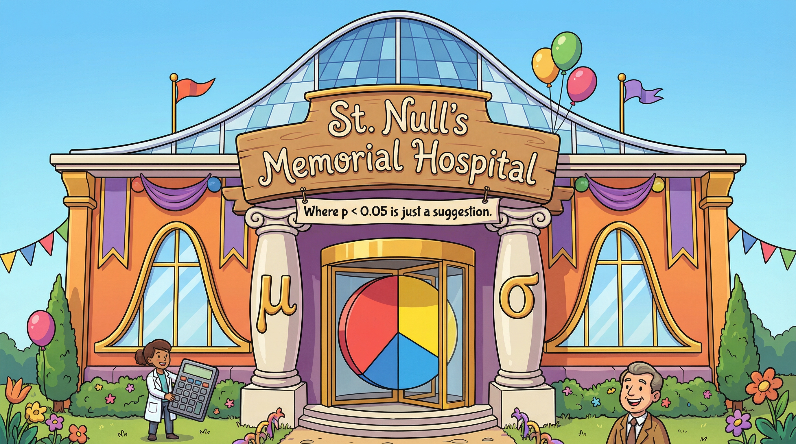
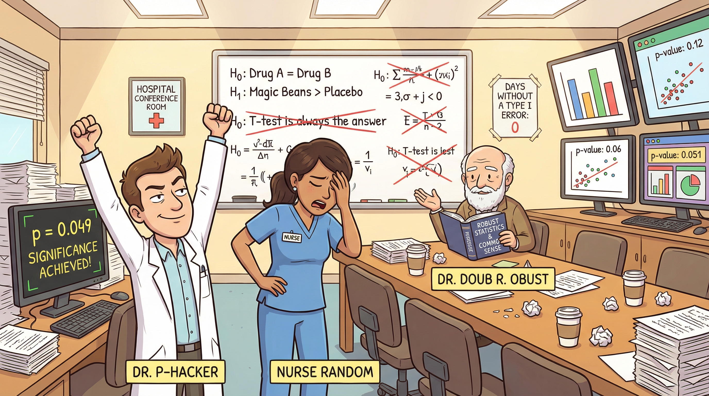

{fig-alt="Cartoon exterior of St. Null's Memorial Hospital with Greek letter columns and a pie chart revolving door" width="100%"}

## The Hospital of Uncertain Outcomes

Welcome to **St. Null's Memorial Hospital** --- an institution where the only constant is confusion. The hospital board changes policies so often that nobody knows what's going on. The hospital's network of clinics, collectively called **The Null Distribution**, is famous for its dedication to meticulous data collection --- and also for some *questionable* statistical practices performed by certain infamous staff members.

At St. Null's, every ward has a p-value dashboard mounted next to the heart monitors. The cafeteria menu is organized by confidence intervals. And the parking lot is stratified into blocks.

Throughout the semester, you'll return to St. Null's for each Problem Set, encountering new crises and methodological disasters that only *you* can sort out.

---

## Meet the Cast

{fig-alt="Group portrait of the four main characters: CEO Barnaby Beta, Dr. P-Hacker, Nurse Random, and Dr. Doub R. Obust" width="100%"}

### CEO Barnaby Beta

**Role:** Hospital Administrator | **Methodological Stance:** Cares about decisions, not p-values

The well-meaning but trend-obsessed CEO of St. Null's. Barnaby gets his management ideas from "Management Buzzwords Monthly" magazine and is known to exclaim things like *"If TikTok can do it, so can we!"* He champions cost-intensive interventions based on vibes, demands quick answers, and has been spotted reading about experimental design on LinkedIn. His heart is in the right place --- his methodology is not.

### Dr. P-Hacker

**Role:** Eager but Misguided Analyst | **Methodological Stance:** Makes the mistakes you must identify and fix

The hospital's self-proclaimed "data guru" who prefers p-values to patients. Dr. P-Hacker mines the electronic health records until *something --- anything!* --- is "significant." He owns a gleaming golden **"p < 0.05"** badge that he waves at staff meetings, declares victory before cleaning the data, and has been known to produce suspiciously precise estimates like "exactly 371.5 lives saved per year." His power calculations conveniently ignore clustering, and his color-coded charts are more persuasive than his methods.

### Nurse Random

**Role:** Principled Methodologist | **Methodological Stance:** Represents sound causal reasoning

The voice of rigor at St. Null's. Nurse Random insists on proper randomized controlled trials, catches Dr. P-Hacker's inflated power calculations, and isn't afraid to point out that the hospital's chaotic ad hoc treatment assignments will cloud any conclusions. Armed with a clipboard and a skeptical eyebrow, she's the one who calls in external consultants (that's you) when things go sideways --- which is always.

### Dr. Doub R. Obust

**Role:** Doubly-Robust Expert | **Methodological Stance:** Introduces DR/DML approaches

The calm, bespectacled sage who lurks in the background, waiting for the right moment to champion doubly robust methods. While others panic, Dr. Obust quietly examines his coffee cup and reminds everyone of fundamental statistical principles. He carries a well-worn textbook labeled *Doubly Robust Methods* and nods knowingly when things go wrong --- because he already predicted they would. He'll become increasingly important as the semester progresses.

### Characters Introduced Later

| Character | Role | Appears In | Methodological Stance |
|-----------|------|------------|----------------------|
| **Dr. Hetty Geneous** | HTE Specialist | PS 3 | Heterogeneous treatment effect analysis |
| **Policy Pete** | Decision Scientist | PS 4 | Policy learning and optimal treatment rules |

---

## A Typical Day at St. Null's

{fig-alt="Chaotic conference room scene with Dr. P-Hacker celebrating a p-value of 0.049 while Nurse Random facepalms and Dr. Doub R. Obust shakes his head" width="100%"}

A typical staff meeting at St. Null's goes something like this:

1. **CEO Barnaby Beta** bursts in with a dramatic announcement about a new crisis
2. **Dr. P-Hacker** claims he's already run the numbers and produces a colorful (but deeply flawed) chart
3. **Nurse Random** raises an eyebrow and points out everything wrong with the analysis
4. **Dr. Doub R. Obust** quietly sips his coffee and suggests a more robust approach
5. Everyone agrees to call in the **methodology consultants from the university** --- that's you

The whiteboard always has crossed-out hypotheses. The "Days Without a Type I Error" counter is perpetually stuck at zero. And somewhere, a monitor is blinking "p = 0.049" in triumphant red.

---

## Your Mission

You and your team of budding methodologists are the new **consultants** hired to impose some order on this bedlam. In each Problem Set, you'll tackle another fiasco at St. Null's --- from underpowered experiments to overfitted models to questionable causal claims --- and attempt to restore some semblance of **methodological rigor**.

Your job is to:

- **Identify** what Dr. P-Hacker did wrong (there's always something)
- **Design** proper studies that CEO Barnaby Beta can understand
- **Implement** the methods that Nurse Random and Dr. Doub R. Obust recommend
- **Communicate** your findings clearly to a non-technical audience

Good luck. You'll need it.

---

*Now proceed to [Problem Set 1: Experimental Design](ps-1-experimental-design.qmd) to begin your first engagement at St. Null's.*
