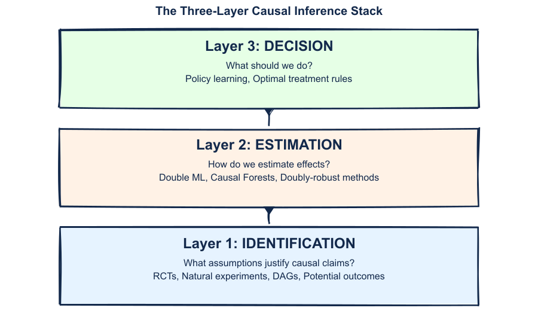

## Welcome to HPM 883 {.center}

**Advanced Quantitative Methods for Health Policy and Management**

Spring 2026

::: {.notes}
Welcome students. This is the third course in the quantitative methods sequence. We're going to explore cutting-edge methods at the intersection of causal inference and machine learning.
:::

---

## Your Professor {.center}

### Sean Sylvia, PhD

::: {.columns}
::: {.column width="50%"}
**Contact**

- 📧 sean.sylvia@unc.edu
- 🏢 McGavran-Greenberg 1101-D
- 🌐 [ssylvia.io](https://ssylvia.io)
:::

::: {.column width="50%"}
**Research Areas**

- Health economics & policy
- AI/ML in clinical decision-making
- Digital health interventions
- Global health systems
:::
:::

::: fragment
**Personal:** Husband and father of 2 middle-schoolers (Zoe and Owen) and a 1-year-old golden retriever (Mochi) 🐕
:::

---

## Your TA {.center}

### Bryan Nice, MPH

- 📧 bnice@email.unc.edu
- 📅 Office hours by appointment

::: fragment
Bryan will help with:

- Lab assignments and code debugging
- GitHub Classroom issues
- General course questions
:::

---

## Today's Agenda

1. **Introductions** — Meet your instructor and TA
2. **Course Logistics** — Websites, software, communication
3. **Assessment & Grading** — Labs, jigsaw, capstone
4. **Causal Inference Foundations** — The central question
5. **Course Framework** — The three-layer stack
6. **Next Steps** — This week's tasks

---

## Course Preliminaries

| Resource | Link |
|----------|------|
| **Course Website** | [hpm883.ssylvia.io](https://hpm883.ssylvia.io) |
| **Canvas** | [uncch.instructure.com/courses/108894](https://uncch.instructure.com/courses/108894) |
| **GitHub Classroom** | [classroom.github.com](https://classroom.github.com/classrooms/253497296-hpm-883-s26) |

::: fragment
### Schedule

- **Lectures:** Monday & Wednesday, 11:15am - 12:30pm
- **Location:** 2304 MC / [Zoom](https://zoom.us/j/93346316978) (hybrid)
- **Office Hours:** Tue 1-2pm, Wed 3-4pm via Zoom
  - [Book appointment](https://calendly.com/sean-sylvia/hpm-883-office-hours-1) — **2 days advance required**
:::

# Course Overview {.center}

## Course Philosophy

::: {.columns}
::: {.column width="50%"}
### What This Course Is

- **Applied focus**: Real health policy problems
- **Modern methods**: Causal ML, not just regression
- **Reproducible research**: Code that others can run
- **AI-assisted analysis**: Learning to work *with* AI tools
:::

::: {.column width="50%"}
### What This Course Is Not

- A statistics refresher (prerequisite: HPM 881-882)
- Pure machine learning for prediction
- Theory without application
- AI doing your thinking for you
:::
:::

::: {.notes}
Set expectations early. This is an advanced course that builds on prior quantitative training. We'll use modern methods but always with a focus on causal questions that matter for health policy.
:::

---

## Course Structure

### Hybrid Format

::: {.columns}
::: {.column width="50%"}
**In-Person Sessions (M/W)**

- Lectures and theory
- Discussion and Q&A
- Location: 2304 MC
:::

::: {.column width="50%"}
**Remote Sessions (Select Days)**

- Hands-on coding labs
- Implementation practice
- Via Zoom
:::
:::

::: fragment
::: {.callout-note}
## Format Varies by Session
Check the schedule — some weeks are all in-person, some mix formats.
:::
:::

---

## Unit Structure (6 Units, 14 Weeks)

### Core Narrative: "Does it work?" → "For whom?" → "What should we do?"

| Unit | Topic | Weeks | Core Question |
|------|-------|-------|---------------|
| 0 | Foundations | 1 | Setup |
| 1 | Experimental Design | 2-3 | Does it work? |
| 2 | DR & DML | 4-6 | Does it work? |
| 3 | HTE & Causal Forests | 7-8 | For whom? |
| 4 | Policy Learning | 9 | What should we do? (static) |
| 5 | Adaptive Experiments | 10-11 | What should we do? (dynamic) |
| — | Capstone & Presentations | 12-14 | Integration |

---

## Work Expectations

### Credit Hour Requirements

::: {.callout-note}
## U.S. Department of Education Definition
One credit hour = 1 hour of direct instruction + **2 hours of out-of-class work** per week.
:::

::: fragment
**For HPM 883 (3 credits):**

| Activity | Hours/Week |
|----------|-----------|
| Class time | 2.5 hrs |
| Reading | 1-1.5 hrs |
| Problem sets / Labs | 3-4 hrs |
| Capstone project | 1-2 hrs |
| **Total** | **~8-10 hrs** |
:::

---

## Communication Channels

::: {.columns}
::: {.column width="33%"}
### Canvas Discussions
**Course questions**

- Problem set help
- Clarifications
- Code issues
- Public Q&A

*Everyone benefits!*
:::

::: {.column width="33%"}
### Course Website
**Updates & materials**

- Schedule changes
- Slides & readings
- Lab materials

*Check regularly!*
:::

::: {.column width="33%"}
### Email
**Personal matters only**

- Scheduling
- Confidential issues
- Administrative

*Non-personal? → Canvas*
:::
:::

---

## Software

::: {.columns}
::: {.column width="50%"}
### You Can Use

- **R** (recommended)
- **Python** (also supported)

*No Stata or other pre-packaged solutions*
:::

::: {.column width="50%"}
### I Will Use

- R for all demonstrations
- RStudio / Positron IDE
- Quarto for reproducible documents
:::
:::

::: fragment
::: {.callout-note}
## Next Session (0.2)
We'll cover computing setup: GitHub Codespaces, R environment, and `DeclareDesign`.
:::
:::

---

## Office Hours & Support

| Resource | When | Where |
|----------|------|-------|
| **Office Hours** | Tue 1-2pm, Wed 3-4pm | Zoom ([Book](https://calendly.com/sean-sylvia/hpm-883-office-hours-1)) |
| **TA** | By appointment | Email Bryan Nice |

::: fragment
::: {.callout-tip}
## Best Practices
- Come with specific questions or code snippets
- Check Canvas Discussion first — someone may have answered already
- Don't wait until the deadline to ask for help
:::
:::

# Assessment & Grading {.center}

## Assessment Structure

| Component | Weight | Description |
|-----------|--------|-------------|
| Labs | 30% | 4 required labs |
| Jigsaw Participation | 20% | ~5 sessions (one per unit) |
| Capstone Project | 45% | PAP, replication, or comparison |
| Peer Review | 5% | Review one peer's project |

::: {.callout-note}
## Jigsaw Sessions
Each unit ends with a **jigsaw paper session**: Expert groups analyze applied papers, then teach each other. Low-stakes participation credit.
:::

---

## Grading Scale

::: {.columns}
::: {.column width="50%"}
### Graduate School Scale

| Grade | Range | Meaning |
|-------|-------|---------|
| **H** | 93-100 | High Pass |
| **P** | 80-92 | Pass |
| **L** | 70-79 | Low Pass |
| **F** | 0-69 | Fail |
:::

::: {.column width="50%"}
### My Philosophy

- **H** = Exceptional work, ready for publication
- **P** = Strong graduate work (most students)
- **L** = Below expectations; needs improvement
- **F** = Did not meet requirements
:::
:::

---

## Capstone Project

### Three Options

::: {.columns}
::: {.column width="33%"}
**Pre-Analysis Plan**

Write a complete PAP for a planned or hypothetical study

- Full identification strategy
- Power analysis
- Estimation approach
- HTE analysis
:::

::: {.column width="33%"}
**Replication + Extension**

Replicate a published study and extend with causal ML

- Reproduce main results
- Apply DML/forests
- Compare approaches
:::

::: {.column width="33%"}
**Methods Comparison**

Compare methods on simulated or real data

- Define DGP
- Apply multiple methods
- Benchmark performance
:::
:::

::: fragment
**Deliverables:** Paper (15-20 pages) + Code repository + 15-min presentation
:::

# The Central Question {.center}

## Why Are We Here?

> When does a health intervention **cause** an outcome to change?

::: fragment
This is fundamentally different from:

- "Are intervention and outcome **associated**?"
- "Can we **predict** outcomes from interventions?"

::: {.callout-important}
## Key Insight
Prediction ≠ Causation. A model that predicts well may tell us nothing about what happens when we intervene.
:::
:::

---

## Prediction vs. Causal Estimation

::: {.columns}
::: {.column width="50%"}
### Prediction (Ŷ)

**Goal:** Forecast outcomes

- Minimize prediction error
- Any features allowed
- Black box OK
- "What will happen?"

**Example:** Predict which patients will be readmitted
:::

::: {.column width="50%"}
### Causal Estimation (β̂)

**Goal:** Estimate treatment effects

- Unbiased estimation
- Confounding matters
- Interpretability needed
- "What if we intervene?"

**Example:** Does discharge planning *reduce* readmissions?
:::
:::

::: fragment
::: {.callout-warning}
## Common Mistake
Using predictive models to make causal claims. Correlation in $\hat{Y}$ ≠ Causation in $\hat{\beta}$.
:::
:::

# The Three-Layer Causal Inference Stack {.center}

## Course Framework

::: {.callout-note}
## Organizing Principle
This three-layer stack is our pedagogical framework for the course — a tool for understanding how methods relate.
:::

{fig-alt="Three-layer stack: Identification at bottom, Estimation in middle, Decision at top" width="80%"}

---

## Layer 1: Identification

**The Question**: Under what assumptions can we interpret an estimate as causal?

::: {.columns}
::: {.column width="50%"}
### Tools
- Potential outcomes framework
- Directed Acyclic Graphs (DAGs)
- Identification strategies
:::

::: {.column width="50%"}
### Course Coverage
- Unit 0: Foundations
- Unit 1: Experimental design
- Unit 2: DML identification
:::
:::

::: {.callout-note}
## Identification First
No amount of sophisticated estimation can rescue a study with flawed identification.
:::

---

## Layer 2: Estimation

**The Question**: Given valid identification, how do we estimate effects efficiently?

::: {.columns}
::: {.column width="50%"}
### Tools
- Double/Debiased ML
- Doubly-robust estimation
- Causal forests
- Influence functions
:::

::: {.column width="50%"}
### Course Coverage
- Unit 2: DR & DML
- Unit 3: Heterogeneous effects
:::
:::

::: {.callout-tip}
## Modern Estimation
ML methods excel at high-dimensional nuisance estimation while preserving valid inference on causal parameters.
:::

---

## Layer 3: Decision

**The Question**: Given estimated effects, what action should we take?

::: {.columns}
::: {.column width="50%"}
### Tools
- Policy learning
- Treatment rules
- Off-policy evaluation
:::

::: {.column width="50%"}
### Course Coverage
- Unit 4: Policy learning
- Unit 5: Adaptive experiments
- Capstone projects
:::
:::

::: {.callout-warning}
## Decision Under Uncertainty
Optimal decisions depend not just on average effects, but on heterogeneity and constraints.
:::

# How ML Helps with Causal Inference {.center}

## The Potential Outcomes Framework

### The Fundamental Setup

For each unit $i$:

- $Y_i(1)$: Outcome if unit receives treatment
- $Y_i(0)$: Outcome if unit receives control
- $D_i$: Treatment indicator (1 = treated, 0 = control)

::: fragment
### The Individual Treatment Effect

$$\tau_i = Y_i(1) - Y_i(0)$$

The causal effect for unit $i$ is the difference between what would happen under treatment versus control.

::: {.notes}
This notation will be used throughout the course. Y(1) is the potential outcome under treatment, Y(0) under control. These are counterfactual outcomes—we can only ever observe one for each unit.
:::
:::

---

## The Fundamental Problem of Causal Inference

::: {.callout-warning}
## The Problem
We can never observe both $Y_i(1)$ and $Y_i(0)$ for the same unit.
:::

| Unit | $Y_i(1)$ | $Y_i(0)$ | $\tau_i$ |
|------|----------|----------|----------|
| 1    | 8        | ?        | ?        |
| 2    | ?        | 5        | ?        |
| 3    | 7        | ?        | ?        |
| 4    | ?        | 6        | ?        |

::: fragment
**The missing data problem**: Every causal inference method is fundamentally about dealing with missing counterfactual outcomes.
:::

---

## Solution 1: Randomization

### Under Random Assignment

$$\text{ATE} = E[Y | D=1] - E[Y | D=0]$$

**Why does this work?**

::: fragment
Randomization ensures treatment and control groups are *exchangeable*:

$$E[Y(1) | D=1] = E[Y(1) | D=0] = E[Y(1)]$$

$$E[Y(0) | D=1] = E[Y(0) | D=0] = E[Y(0)]$$

::: {.callout-tip}
## This is Unit 1
Experimental design: power, randomization inference, blocking, variance reduction.
:::
:::

---

## Solution 2: Conditional Independence

### When Randomization Isn't Possible

Without experiments, we need **conditional ignorability**:

$$Y(1), Y(0) \perp\!\!\!\perp D \mid X$$

"After controlling for $X$, treatment is as good as random."

::: fragment
```{r}
#| fig-width: 6
#| fig-height: 3
#| fig-align: center
library(ggplot2)
library(ggdag)
library(dagitty)

dag <- dagify(
  Y ~ D + X,
  D ~ X,
  exposure = "D",
  outcome = "Y",
  coords = list(x = c(X = 1, D = 0, Y = 2), y = c(X = 1.2, D = 0, Y = 0))
)

# Gillings brand colors
gillings_navy <- "#13294B"
gillings_carolina <- "#4B9CD3"

ggdag(dag, text = FALSE, node_size = 22) +
  geom_dag_point(color = gillings_navy, size = 22) +
  geom_dag_text(color = "white", size = 5, fontface = "bold") +
  geom_dag_edges(edge_color = gillings_navy, edge_width = 1.2) +
  theme_dag() +
  labs(title = "Confounding: X affects both D and Y") +
  theme(legend.position = "none",
        plot.title = element_text(hjust = 0.5, size = 16, color = gillings_navy))
```

**Control for X** → Block the backdoor path → Identify causal effect
:::

---

## How ML Helps: Nuisance Estimation

### The Problem with High-Dimensional X

Traditional approach: Model $E[Y|D,X]$ parametrically

::: fragment
**But what if X is complex?**

- Many covariates
- Nonlinear relationships
- Interactions
:::

::: fragment
### The ML Solution: Double/Debiased ML

Use ML to estimate **nuisance functions** (propensity score, outcome model) while preserving valid inference on $\hat{\tau}$.

::: {.callout-tip}
## This is Unit 2
Influence functions, orthogonal scores, cross-fitting.
:::
:::

---

## Beyond Averages: Treatment Effect Heterogeneity

### Conditional Average Treatment Effect

$$\text{CATE}(x) = E[Y(1) - Y(0) | X = x]$$

The average effect for units with characteristics $X = x$.

::: fragment
### Why It Matters for Health Policy

- **Personalized medicine**: Who benefits most from treatment?
- **Resource allocation**: Where should we target interventions?
- **Equity**: Do effects differ across populations?

::: {.callout-tip}
## This is Units 3-4
Causal forests, meta-learners, policy learning.
:::
:::

---

## ML for Experimental Design

### Adaptive Experiments

::: {.columns}
::: {.column width="50%"}
**Traditional RCT**

- Fixed assignment probabilities
- Equal allocation
- Static design
:::

::: {.column width="50%"}
**Adaptive/ML-Enhanced**

- Response-adaptive randomization
- Covariate-adaptive allocation
- Bandits and exploration
:::
:::

::: fragment
### How ML Helps

1. **Variance reduction** via covariate adjustment
2. **Blocking and stratification** with many covariates
3. **Adaptive designs** that learn during trial
4. **Power optimization** using baseline predictions

::: {.callout-tip}
## This is Unit 1
Design-based inference with modern tools.
:::
:::

# AI in Your Workflow {.center}

## "AI in the Loop" — Not "Human in the Loop"

::: {.columns}
::: {.column width="60%"}
### Human-Driven, AI-Assisted

1. **You** specify the causal question
2. **You** choose the identification strategy
3. **AI** assists with implementation
4. **You** evaluate and interpret results
5. **You** make the decision
:::

::: {.column width="40%"}
### Why It Matters

- AI can't choose your research question
- AI can hallucinate methods
- AI doesn't know your context
- AI can't defend your work
- **You are responsible**
:::
:::

::: {.notes}
This distinction is crucial. Many people talk about "human in the loop" for AI systems. In research, we flip this: the human drives the process, AI assists. You maintain control and responsibility.
:::

---

## AI in Causal Analysis: Do's and Don'ts

::: {.columns}
::: {.column width="50%"}
### ✅ Good Uses of AI

- Code implementation
- Debugging syntax errors
- Explaining methods
- Generating simulations
- Formatting output
:::

::: {.column width="50%"}
### ❌ Risky Uses of AI

- Choosing identification strategy
- Interpreting results for you
- Making causal claims
- Selecting variables
- "Just run an analysis"
:::
:::

::: {.callout-important}
## Course Policy
You may use AI tools, but you must **disclose which AI model(s) you used and how** for any assignment. You are responsible for all submitted work. You must understand and be able to explain every line of code and every claim.
:::

# Course Materials {.center}

## Primary Textbooks (Both FREE!)

::: {.columns}
::: {.column width="50%"}
### Chernozhukov et al. (2025)
*Applied Causal Inference Powered by ML and AI*

[causalml-book.org](https://causalml-book.org/)

- Practitioner-focused
- Python + R code
- Industry examples
:::

::: {.column width="50%"}
### Wager (2024)
*Causal Inference: A Statistical Learning Approach*

[Stanford PDF](http://web.stanford.edu/~swager/causal_inf_book.pdf)

- Theoretical foundations
- Math-forward
- Research orientation
:::
:::

::: {.callout-tip}
## Reading Strategy
Use Chernozhukov for implementation, Wager for deeper understanding of the theory.
:::

---

## Methods Preview

### What You'll Learn

::: {.columns}
::: {.column width="33%"}
#### Estimation
- Double ML
- AIPW
- Influence functions
:::

::: {.column width="33%"}
#### Heterogeneity
- Causal forests
- Meta-learners
- CATE estimation
:::

::: {.column width="33%"}
#### Policy
- Policy trees
- Off-policy evaluation
- Treatment rules
:::
:::

::: fragment
### R Packages

`DoubleML` | `grf` | `policytree` | `DeclareDesign` | `contextual`
:::

# This Week {.center}

## This Week's Goals

### By End of Unit 0 (Week 1)

1. ✅ Understand the three-layer causal inference stack
2. 📐 Apply potential outcomes framework
3. 📊 Construct and interpret basic DAGs
4. 💻 Set up reproducible R environment
5. 🔬 Simulate basic RCT and estimate ATE

---

## Next Session: Session 0.2 (Jan 12)

### Reproducible Research Setup (Remote via Zoom)

- GitHub Codespaces setup
- Git/GitHub fundamentals
- Introduction to `DeclareDesign`
- Simulating RCT data in R

::: {.callout-important}
## Preparation
Create a GitHub account if you don't have one. We'll use GitHub Codespaces in Session 0.2.
:::

---

## Reading Assignment

### For Session 0.2 (Monday — Zoom)

**Required:**

- Review [Computing Setup](../computing.qmd) page on course website

**Optional:**

- [Chernozhukov Ch. 0 (Sneak Peek)](http://chapters.causalml-book.org/CausalML_chap_0.pdf) — ~10 pages (course roadmap)
- [R for Data Science Ch. 1-5](https://r4ds.hadley.nz/) (R refresher)

---

## Summary

### Key Takeaways

1. **Three-layer stack**: Identification → Estimation → Decision
2. **Prediction ≠ Causation**: Different goals require different methods
3. **Potential outcomes**: $Y(1)$, $Y(0)$, and the fundamental problem
4. **ML helps**: Nuisance estimation, HTE, adaptive design
5. **AI in the Loop**: Human-driven, AI-assisted analysis
6. **This course**: Modern causal ML for health policy

---

## Questions? {.center}

::: {.callout-note}
## Office Hours
Tue 1-2pm, Wed 3-4pm via Zoom — [Book appointment](https://calendly.com/sean-sylvia/hpm-883-office-hours-1)
:::

::: {.notes}
Recap the key points. Next session we'll get hands-on with R setup and start simulating data.
:::
