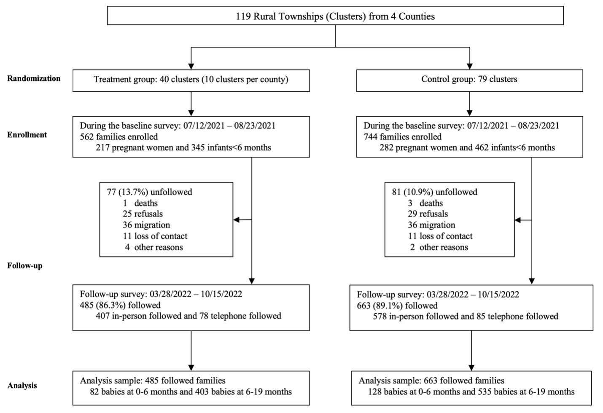
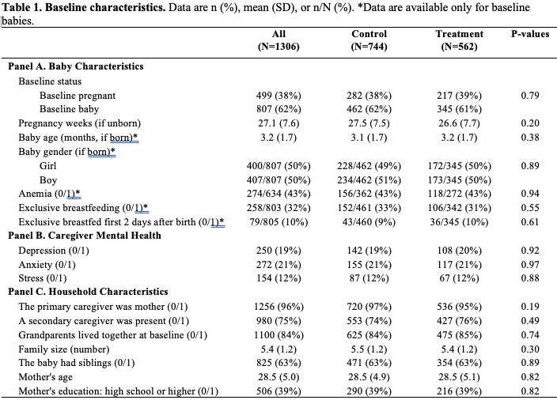
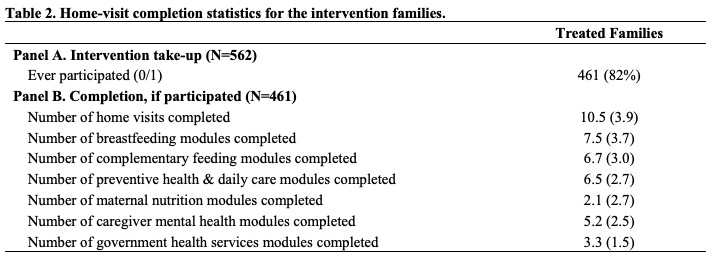
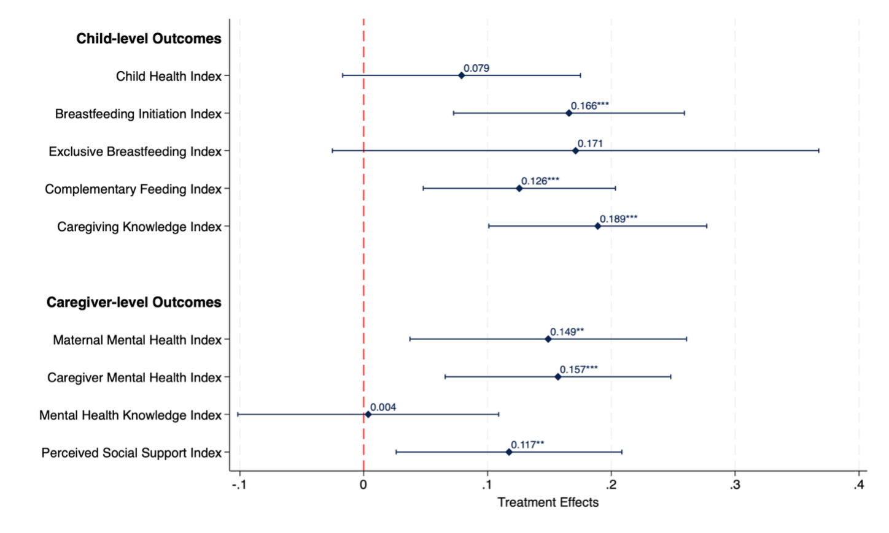
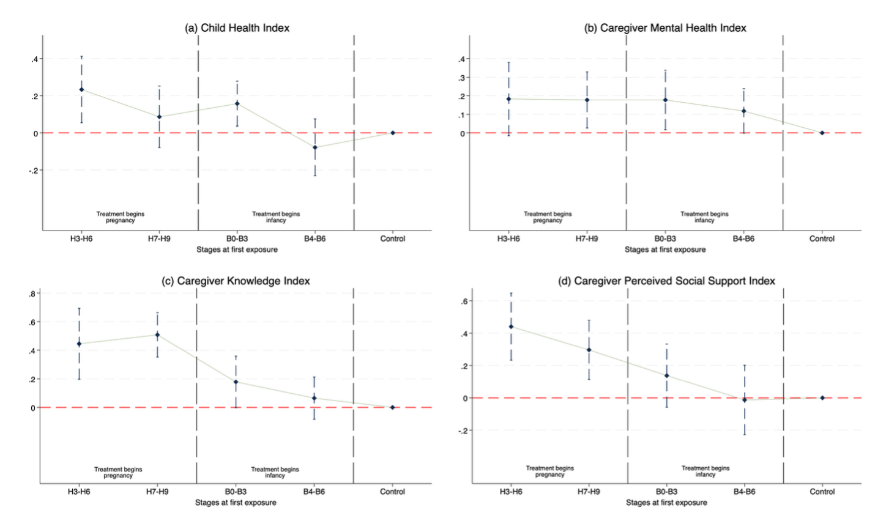

```{r setup}
#| include: false
library(tidyverse)
library(knitr)
library(kableExtra)
library(ggdag)
library(dagitty)
```

# Introduction

## Today's Question

::: {.callout-note appearance="simple"}
## The Fundamental Problem
**Why does randomization work?**

And what exactly does it accomplish?
:::

. . .

::: {.fragment}
By the end of today, you'll understand:

- The **potential outcomes framework** as our language for causal inference
- Why **selection bias** is the core problem
- How **randomization** solves it
- The difference between **design-based** and **model-based** inference
:::

## Session Roadmap

| Section | Topic | Time |
|---------|-------|------|
| 1 | Potential Outcomes Framework | 20 min |
| 2 | The Selection Problem | 15 min |
| 3 | Randomization as Solution | 15 min |
| 4 | Case Study: Healthy Futures RCT | 10 min |
| 5 | Design-Based vs Model-Based | 10 min |
| 6 | Wrap-up | 5 min |

::: {.notes}
This is foundational material. Everything else in this course builds on understanding why randomization works and what it accomplishes.
:::

# Potential Outcomes Framework

## The Counterfactual Question

::: {.callout-tip}
## Causal Inference in One Sentence
**What would have happened to the same unit under a different treatment?**
:::

. . .

**Example:** Does a new diabetes management app improve HbA1c?

- Patient receives the app → HbA1c drops from 8.5% to 7.2%
- **Causal question:** Would HbA1c have dropped *anyway*?

. . .

We can never observe both:

- What happened (factual)
- What would have happened (counterfactual)

## Notation: Potential Outcomes

For each unit $i$:

::: {.columns}
::: {.column width="50%"}
**Treatment indicator:**
$$D_i = \begin{cases} 1 & \text{if treated} \\ 0 & \text{if control} \end{cases}$$
:::

::: {.column width="50%"}
**Potential outcomes:**
$$Y_i(1) = \text{outcome if treated}$$
$$Y_i(0) = \text{outcome if control}$$
:::
:::

. . .

::: {.callout-important}
## The Fundamental Problem of Causal Inference
We only observe **one** potential outcome per unit:
$$Y_i = D_i \cdot Y_i(1) + (1 - D_i) \cdot Y_i(0)$$
:::

## Individual Treatment Effect

For each unit, the **individual treatment effect** is:

$$\tau_i = Y_i(1) - Y_i(0)$$

. . .

::: {.fragment}
**The problem:** We can never observe $\tau_i$ for any individual!

| Unit | $Y_i(0)$ | $Y_i(1)$ | $\tau_i$ | Observed |
|------|----------|----------|----------|----------|
| 1    | 8.0      | 7.2      | -0.8     | ? |
| 2    | 7.5      | 7.1      | -0.4     | ? |
| 3    | 9.0      | 8.2      | -0.8     | ? |
:::

::: {.notes}
This is why we need to move from individual effects to average effects, and why we need assumptions about how treatment is assigned.
:::

## Potential Outcomes in Action: Vaccine Efficacy

::: {.callout-tip}
## Real-World Example
COVID-19 vaccine trials demonstrate potential outcomes thinking in a context everyone experienced.
:::

. . .

**The Question:** Does the vaccine prevent COVID-19 infection?

::: {.columns}
::: {.column width="50%"}
**Potential Outcomes:**

- $Y_i(1)$ = infection status if vaccinated
- $Y_i(0)$ = infection status if placebo
- $Y_i \in \{0, 1\}$ (binary: infected or not)
:::

::: {.column width="50%"}
**Individual Effect:**

$$\tau_i = Y_i(1) - Y_i(0)$$

- $\tau_i = -1$: Vaccine prevents infection
- $\tau_i = 0$: No effect for this person
- $\tau_i = +1$: (Rare) Vaccine causes infection
:::
:::

## Vaccine Trial: The Data

```{r vaccine-table}
#| echo: false
vaccine_data <- tibble(
  Person = 1:8,
  `Y(0)` = c(1, 1, 0, 1, 0, 0, 1, 0),  # Would get infected without vaccine
  `Y(1)` = c(0, 0, 0, 1, 0, 0, 0, 0),  # Outcome with vaccine
  `True Effect` = `Y(1)` - `Y(0)`,
  `Assigned` = c("Vaccine", "Vaccine", "Vaccine", "Vaccine", "Placebo", "Placebo", "Placebo", "Placebo"),
  `Observed Y` = c(0, 0, 0, 1, 0, 0, 1, 0)
)

vaccine_data %>%
  kable(digits = 0, align = "c") %>%
  kable_styling(font_size = 20) %>%
  row_spec(1:4, background = "#e6f3ff") %>%
  row_spec(5:8, background = "#fff3e6")
```

. . .

**What the trial observed:**

- Vaccine group infection rate: $1/4 = 25\%$
- Placebo group infection rate: $1/4 = 25\%$
- **Observed efficacy:** $(25\% - 25\%)/25\% = 0\%$ 😱

## Wait—What's the True Effect?

**True ATE** (if we could see all potential outcomes):

$$\text{ATE} = \mathbb{E}[Y(1) - Y(0)] = \frac{-1 + -1 + 0 + 0 + 0 + 0 + -1 + 0}{8} = -0.375$$

. . .

::: {.callout-warning}
## What Happened?
In this small sample, **randomization luck** gave us an unrepresentative split.

The people who would have gotten infected anyway (high $Y(0)$) happened to end up in the placebo group.
:::

. . .

::: {.fragment}
**This is not selection bias** (treatment was random)—it's **sampling variability**.

With larger samples, randomization balances potential outcomes *in expectation*.
:::

::: {.notes}
This example shows why we need large samples AND randomization. Randomization eliminates systematic bias; large samples reduce random variability.
:::

# The Selection Problem

## What Went Wrong?

::: {.columns}
::: {.column width="50%"}
**What we estimated:**
$$\mathbb{E}[Y|D=1] - \mathbb{E}[Y|D=0]$$

This is a **comparison of different people**.
:::

::: {.column width="50%"}
**What we wanted:**
$$\mathbb{E}[Y(1) - Y(0)]$$

This is the **effect on the same people**.
:::
:::

. . .

::: {.callout-important}
## Selection Bias
$$\underbrace{\mathbb{E}[Y|D=1] - \mathbb{E}[Y|D=0]}_{\text{Observed Difference}} = \underbrace{\mathbb{E}[Y(1) - Y(0)]}_{\text{Causal Effect}} + \underbrace{\mathbb{E}[Y(0)|D=1] - \mathbb{E}[Y(0)|D=0]}_{\text{Selection Bias}}$$
:::

## APE vs ACE: Terminology Matters

::: {.callout-note}
## Chernozhukov et al. (2025) Terminology
These terms help distinguish what we *can* observe from what we *want* to know.
:::

| Quantity | Definition | Interpretation |
|----------|------------|----------------|
| **APE** (Average Predictive Effect) | $\mathbb{E}[Y|D=1] - \mathbb{E}[Y|D=0]$ | What we can calculate from data |
| **ACE/ATE** (Average Causal Effect) | $\mathbb{E}[Y(1) - Y(0)]$ | What we want to know |

. . .

**The relationship:**

$$\text{APE} = \text{ACE} + \text{Selection Bias}$$

. . .

::: {.fragment}
::: {.callout-tip}
## The Goal of Causal Inference
Find conditions under which **APE = ACE** (i.e., selection bias = 0)
:::
:::

## Visualizing Selection Bias

```{r dag-selection}
#| fig-height: 4
#| fig-width: 8

dag <- dagify(
  Y ~ D + U,
  D ~ U,
  coords = list(
    x = c(D = 0, Y = 2, U = 1),
    y = c(D = 0, Y = 0, U = 1)
  ),
  labels = c(
    D = "Treatment",
    Y = "Outcome",
    U = "Confounders"
  )
)

ggdag(dag, text = FALSE, use_labels = "label") +
  theme_dag() +
  theme(
    legend.position = "none",
    plot.background = element_rect(fill = "white", color = NA)
  )
```

::: {.fragment}
**The backdoor path:** Treatment ← Confounders → Outcome

Selection bias = association flowing through confounders
:::

## Sources of Selection Bias in Health Research

::: {.incremental}
1. **Self-selection**: Healthier patients choose preventive care
2. **Provider selection**: Sicker patients get referred to specialists
3. **Access**: SES affects both treatment access and outcomes
4. **Survival bias**: Only survivors observed in follow-up
5. **Healthy user bias**: Medication adherent = generally healthy behaviors
:::

::: {.notes}
Ask students for examples from their own research areas.
:::

# Randomization as Solution

## The Magic of Randomization

::: {.callout-tip}
## Key Insight
Randomization makes treatment assignment **independent** of potential outcomes.
$$D \perp\!\!\!\perp (Y(0), Y(1))$$
:::

. . .

**What this means:**

- Treated and control groups are *comparable* in expectation
- No systematic differences in who gets treated
- **Selection bias = 0**

## Why Independence Matters

If $D \perp\!\!\!\perp (Y(0), Y(1))$, then:

$$\mathbb{E}[Y(0)|D=1] = \mathbb{E}[Y(0)|D=0] = \mathbb{E}[Y(0)]$$

. . .

**The selection bias term vanishes:**

$$\underbrace{\mathbb{E}[Y(0)|D=1] - \mathbb{E}[Y(0)|D=0]}_{= 0 \text{ under randomization}} = 0$$

. . .

::: {.callout-note}
## Result
Under randomization:
$$\mathbb{E}[Y|D=1] - \mathbb{E}[Y|D=0] = \mathbb{E}[Y(1) - Y(0)] = \text{ATE}$$
:::

## SUTVA: The Hidden Assumptions

::: {.callout-warning}
## Stable Unit Treatment Value Assumption (SUTVA)
Randomization gives us independence, but we also need **SUTVA** for potential outcomes to be well-defined.
:::

. . .

**SUTVA has two parts:**

::: {.columns}
::: {.column width="50%"}
**1. Consistency**
$$Y_i = Y_i(D_i)$$

The observed outcome equals the potential outcome corresponding to the treatment received.
:::

::: {.column width="50%"}
**2. No Interference**
$$Y_i(d) \text{ doesn't depend on } D_j$$

One unit's treatment doesn't affect another unit's outcome.
:::
:::

. . .

::: {.callout-tip}
## Why It Matters
Without SUTVA, potential outcomes aren't well-defined—$Y_i(1)$ could mean different things depending on who else is treated!
:::

## When SUTVA Fails

::: {.incremental}
**Consistency violations:**

- Multiple versions of treatment (different doses, different providers)
- Treatment varies based on context

**Interference violations:**

- Vaccination reduces disease spread → affects untreated
- Classroom interventions → peer effects
- Village-level programs → spillovers to control villages
:::

. . .

::: {.callout-note}
## Connection to Exclusion Restriction
SUTVA is related to the **exclusion restriction**: treatment assignment affects outcomes *only through* treatment received.
:::

::: {.notes}
We'll revisit interference in the cluster randomization discussion. For now, individual-level RCTs with clear treatments typically satisfy SUTVA.
:::

## Randomization Breaks the Backdoor

```{r dag-randomized}
#| fig-height: 4
#| fig-width: 8

dag_rct <- dagify(
  Y ~ D + U,
  coords = list(
    x = c(D = 0, Y = 2, U = 1),
    y = c(D = 0, Y = 0, U = 1)
  ),
  labels = c(
    D = "Treatment\n(Randomized)",
    Y = "Outcome",
    U = "Confounders"
  )
)

ggdag(dag_rct, text = FALSE, use_labels = "label") +
  theme_dag() +
  theme(
    legend.position = "none",
    plot.background = element_rect(fill = "white", color = NA)
  )
```

::: {.fragment}
**No arrow from U to D** → No backdoor path → No selection bias

Randomization is like "pressing delete" on the confounder → treatment arrow.
:::

## Causal Estimands: A Quick Tour

| Estimand | Definition | When to Use |
|----------|------------|-------------|
| **ATE** | $\mathbb{E}[Y(1) - Y(0)]$ | Population-level policy |
| **ATT** | $\mathbb{E}[Y(1) - Y(0)|D=1]$ | Effect on those who would take treatment |
| **ITT** | Effect of *assignment* | Noncompliance present |
| **LATE** | Effect on *compliers* | IV/encouragement design |

. . .

::: {.callout-note}
## In a Perfect RCT
With full compliance: ATE = ATT = ITT

Reality is messier—we'll discuss this in later sessions.
:::

# Case Study: Healthy Futures RCT

## The Research Question

::: {.callout-tip}
## Healthy Futures Study (China, 2019-2022)
**Can mHealth-supported home visits improve maternal and child health in rural China?**
:::

. . .

**Setting:** Rural Sichuan Province, 4 former poverty-stricken counties

**Population:** Pregnant women (2nd trimester) or families with infants <6 months

**Intervention:** Community health workers (CHWs) deliver home visits supported by a mobile app, from pregnancy through 18 months postpartum

. . .

::: {.fragment}
**Outcomes:**
- Child development (cognition, language, motor)
- Caregiving practices
- Maternal mental health
:::

## Trial Profile

{fig-alt="Trial profile showing 119 townships randomized to 40 treatment vs 79 control clusters, with enrollment, follow-up, and analysis sample sizes" width="95%"}

::: {.callout-note}
## Reading a Trial Profile
- **Randomization**: 40 vs 79 clusters (townships)
- **Enrollment**: 562 treatment, 744 control families
- **Analysis**: ~460 families per arm at follow-up
:::

## The Healthy Futures App

::: {.callout-tip}
## Watch: mHealth Platform in Action
[**View the Healthy Futures App Demo** →](https://www.canva.com/design/DAG_D0qj1Ec/jv1UuoK_JNEK8PZM6CMg0g/view){target="_blank"}
:::

. . .

**What you'll see:**

- CHW interface for home visits
- Stage-based content delivery
- Data collection and monitoring

## The Intervention: Stage-Based Modules

{fig-alt="Timeline showing 12 intervention modules from pregnancy through 18 months" width="95%"}

::: {.callout-note}
## Stage-Based Design
Modules activated at developmentally appropriate times — CHWs guided by mobile app
:::

## Why Cluster Randomization?

::: {.callout-warning}
## The Key Design Decision
We randomized **townships**, not individual families. Why?
:::

. . .

::: {.incremental}
1. **CHW training at township level** → Same CHW serves multiple families
   - Randomizing families creates contamination risk

2. **Information spreads within communities**
   - Mothers share parenting tips at village gatherings
   - Spillover effects within townships

3. **Implementation logistics**
   - Training, supervision, and monitoring at township level
   - Would be impractical to train one CHW differently per family
:::

## Healthy Futures: Design Details

| Design Element | Choice | Rationale |
|----------------|--------|-----------|
| **Unit of randomization** | 119 townships | Avoid contamination |
| **Stratification** | By county (4 strata) | Geographic balance |
| **Allocation** | 40 treatment : 79 control | Budget constraints |
| **Sample** | 1,306 families | Power for child outcomes |

. . .

::: {.callout-note}
## Unequal Allocation
Why 40:79 instead of 50:50?

- CHW training is costly (per-township fixed cost)
- More control townships cheaper to enroll
- Power calculation showed acceptable tradeoff
:::

## Did Randomization Work?

{fig-alt="Table showing baseline balance with all p-values > 0.05" width="80%"}

. . .

::: {.fragment}
**All p-values > 0.05** → Randomization achieved balance on observables
:::

## Did Families Actually Participate?

{fig-alt="Table showing 82% participation rate and module completion statistics" width="85%"}

. . .

::: {.callout-tip}
## ITT vs TOT
- **82% ever participated** — high take-up
- Avg **10.5 home visits** per family (of ~14 possible)
- ITT estimates effect of *offer*; TOT estimates effect of *receiving*
:::

## SUTVA in Cluster RCTs

::: {.columns}
::: {.column width="50%"}
### ✓ No Interference Across Clusters

- Townships geographically separated
- Different CHWs, different communities
- Minimal contact between villages in different townships
:::

::: {.column width="50%"}
### ⚠ Spillovers Within Clusters

- Mothers in same village share information
- This is a **feature, not a bug**!
- We want to measure total effect including spillovers
:::
:::

. . .

::: {.callout-tip}
## Connection to Today's Concepts
- **Independence** achieved at township level
- **SUTVA** redefined: potential outcomes depend on *cluster* assignment
- Analysis must account for **correlation within clusters**
:::

## What Did We Find?

{fig-alt="Forest plot showing significant positive effects on breastfeeding, complementary feeding, caregiving knowledge, and caregiver mental health" width="90%"}

. . .

::: {.fragment}
**Significant improvements** in caregiving practices and maternal mental health

*Child health index: positive but not statistically significant*
:::

## Does Earlier Enrollment Help?

{fig-alt="Four panels showing effects vary by when families enrolled, with pregnancy enrollment showing stronger effects" width="90%"}

. . .

::: {.callout-note}
## Heterogeneous Treatment Effects (Preview of Unit 3)
- Effects vary by timing of enrollment
- Earlier enrollment → more exposure → larger effects?
- We'll learn methods to analyze this systematically in Unit 3
:::

## Lessons for Your Research

::: {.incremental}
1. **Randomization unit ≠ analysis unit**
   - Cluster if treatment operates at group level

2. **Stratification improves balance**
   - Block on key variables (geography, baseline characteristics)

3. **Allocation can be unequal**
   - Optimize for budget, power, and logistics

4. **SUTVA requires thought**
   - Define clearly: what interference do you allow/expect?
:::

. . .

::: {.fragment}
::: {.callout-note}
## Coming in Session 1.3
We'll formally cover cluster randomization, ICCs, and design-based variance reduction.
:::
:::

# Design-Based vs Model-Based Inference

## Two Philosophies

::: {.columns}
::: {.column width="50%"}
### Design-Based (Randomization)

- Inference from randomization distribution
- No assumptions about outcome model
- "What would happen if we re-randomized?"
- Finite-sample exact
:::

::: {.column width="50%"}
### Model-Based (Superpopulation)

- Inference from assumed data-generating process
- Requires model assumptions
- "What is the parameter in the population?"
- Asymptotic approximations
:::
:::

. . .

::: {.callout-tip}
## Good News
In most RCT settings, both approaches give similar answers. Understanding both helps you communicate with different audiences.
:::

## The Randomization Distribution

**Design-based inference asks:** Given our sample, what's the distribution of estimates across all possible treatment assignments?

. . .

```{r randomization-dist}
#| fig-height: 3.5
#| fig-width: 8

set.seed(883)
# Simulate randomization distribution
n <- 20
true_effect <- -0.5
y0 <- rnorm(n, 8, 1)
y1 <- y0 + true_effect + rnorm(n, 0, 0.3)

# Many possible randomizations
n_perms <- 1000
estimates <- map_dbl(1:n_perms, function(x) {
  d <- sample(c(rep(1, n/2), rep(0, n/2)))
  y_obs <- d * y1 + (1-d) * y0
  mean(y_obs[d==1]) - mean(y_obs[d==0])
})

ggplot(tibble(est = estimates), aes(x = est)) +
  geom_histogram(bins = 30, fill = "#4a90a4", alpha = 0.7) +
  geom_vline(xintercept = true_effect, color = "red", linewidth = 1.5, linetype = "dashed") +
  labs(
    x = "Estimated Treatment Effect",
    y = "Count",
    title = "Randomization Distribution of Treatment Effect Estimates",
    subtitle = "Red line = true effect; histogram = possible estimates under different randomizations"
  ) +
  theme_minimal(base_size = 14)
```

## Fisher's Sharp Null

::: {.callout-note}
## Fisher's Sharp Null Hypothesis
$$H_0: Y_i(1) = Y_i(0) \text{ for all } i$$

The treatment has **no effect on anyone**.
:::

. . .

**Testing procedure:**

1. Compute test statistic (e.g., difference in means)
2. Under $H_0$, we know all potential outcomes
3. Enumerate (or simulate) all possible randomizations
4. p-value = proportion of randomizations with test stat as extreme

::: {.fragment}
This is the foundation of **permutation tests**.
:::

## Neyman's Framework

::: {.callout-note}
## Neyman's Approach
Focus on estimating the **Average Treatment Effect**:
$$\tau = \frac{1}{n}\sum_{i=1}^{n}[Y_i(1) - Y_i(0)]$$
:::

. . .

**Key results:**

- Difference-in-means is unbiased for ATE
- Variance depends on treatment effect heterogeneity
- Conservative variance estimator available

::: {.fragment}
$$\widehat{\text{Var}}(\hat{\tau}) = \frac{s_1^2}{n_1} + \frac{s_0^2}{n_0}$$
:::

## Historical Development of the Potential Outcomes Framework

::: {.callout-note}
## A Century of Development
The ideas behind randomized experiments developed across disciplines and decades.
:::

| Year | Contributor | Contribution |
|------|-------------|--------------|
| 1923 | **Neyman** | Potential outcomes, ATE, variance formulas (agricultural experiments) |
| 1935 | **Fisher** | Randomization inference, sharp null hypothesis, permutation tests |
| 1974 | **Rubin** | Unified potential outcomes framework, missing data perspective |
| 1986 | **Holland** | "No causation without manipulation," formalized FPCI |
| 2000s | **Imbens & Rubin** | Modern synthesis, treatment effect bounds, IV |

. . .

::: {.callout-tip}
## Why History Matters
Understanding origins helps you:

- Know when to cite Neyman (estimation) vs Fisher (testing)
- Recognize the "Rubin Causal Model" is really Neyman + Fisher + Rubin
- Communicate with statisticians vs econometricians vs epidemiologists
:::

## Practical Implications

| Situation | Recommendation |
|-----------|----------------|
| Small sample, exact inference needed | Design-based (permutation) |
| Large sample, standard errors needed | Either works |
| Communicating with clinicians | Model-based often clearer |
| Communicating with statisticians | Design-based more rigorous |
| Heterogeneous effects expected | Both, with caution on variance |

::: {.notes}
The good news is that for most RCTs, you get similar answers. Understanding both helps you communicate and catch errors.
:::

# Wrap-Up

## Key Takeaways

::: {.incremental}
1. **Potential outcomes** provide precise language for causal questions
2. The **fundamental problem**: we never observe both $Y(0)$ and $Y(1)$
3. **Selection bias** arises when treatment is related to potential outcomes
4. **Randomization** breaks the confounder → treatment link
5. **Design-based** inference: distribution from randomization
6. **Model-based** inference: distribution from assumed model
:::

## Looking Ahead

::: {.columns}
::: {.column width="50%"}
**Session 1.2: Power Analysis**

- How many subjects do we need?
- Minimum detectable effects
- Power calculations in R
:::

::: {.column width="50%"}
**Session 1.3: Optimal Design**

- Blocking and stratification
- Cluster randomization
- Design-based variance reduction
:::
:::

. . .

::: {.callout-tip}
## Before Next Time
Review Chernozhukov Ch. 1 on potential outcomes and read Athey & Imbens (2017) introduction.
:::

## Questions?

::: {.callout-note appearance="minimal"}
**Office Hours:** Tuesdays 2-3pm or by appointment

**Slack:** #hpm883-questions
:::

# Appendix {visibility="uncounted"}

## References {visibility="uncounted"}

- Rubin, D. B. (1974). Estimating causal effects of treatments in randomized and nonrandomized studies.
- Holland, P. W. (1986). Statistics and causal inference.
- Imbens, G. W., & Rubin, D. B. (2015). Causal inference for statistics, social, and biomedical sciences.
- Athey, S., & Imbens, G. W. (2017). The econometrics of randomized experiments.

## Notation Reference {visibility="uncounted"}

| Symbol | Meaning |
|--------|---------|
| $D_i$ | Treatment indicator (1 = treated, 0 = control) |
| $Y_i(1)$ | Potential outcome under treatment |
| $Y_i(0)$ | Potential outcome under control |
| $\tau_i$ | Individual treatment effect |
| ATE | Average Treatment Effect |
| ATT | Average Treatment Effect on the Treated |
| ITT | Intent-to-Treat effect |
| LATE | Local Average Treatment Effect |
