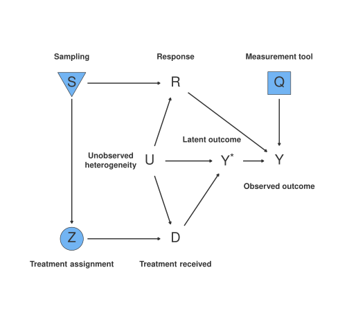

# Where Does Uncertainty Come From?

## Uncertainty in Experimental Studies

Before getting into estimation and the uncertainty of the estimate, we need to be precise about the **source of uncertainty**.

. . .

In experimental studies, uncertainty is an inherent part of the inference process, arising from several key sources.

::: {.callout-important}
## Why This Matters
Recognizing these sources is critical to **designing robust experiments** and **correctly interpreting** the results.
:::

## Three Sources of Uncertainty

:::: {.columns}
::: {.column width="60%"}
1. **Sampling Variation**
   - Any sample is just one of many possible samples
   - The same treatment might yield different results with a different sample
   - Reflects random fluctuations in the selection process

2. **Variance in Potential Outcomes**
   - Natural variability in outcomes under different treatment conditions
   - High variance obscures the treatment effect signal
   - Reduces power to reject a false null hypothesis

3. **Measurement Error**
   - Inaccuracies in recording or assessing outcomes
   - Introduces additional variability
   - Can bias the estimated treatment effect
:::

::: {.column width="40%"}
::: {.callout-tip}
## Think About It
Which of these three sources can the researcher **control**?
:::
:::
::::

## The Data Strategy DAG

{fig-align="center"}

Three elements of data strategies are in the **researcher's control** (blue boxes):

- **S** — Sampling procedure
- **Z** — Treatment assignment
- **Q** — Measurement procedure

## Reading the DAG

The researcher's choices affect **endogenous variables**:

| Researcher Node | Endogenous Variable | Also Affected By |
|:---:|:---:|:---:|
| **S** (Sampling) | **R** (Response/participation) | U (unobserved) |
| **Z** (Assignment) | **D** (Treatment received) | U (unobserved) |
| **Q** (Measurement) | **Y** (Observed outcome) | Y* (latent), U |

. . .

::: {.callout-note}
No arrows go **into** S, Z, or Q — they are set by the researcher.
:::

## Exclusion Restrictions Revisited

::: {.callout-tip}
## Exercise
Can you draw **four arrows** representing the four exclusion restrictions?

Think about the direct paths from researcher-controlled nodes (S, Z, Q) to outcomes that would **violate** our assumptions.
:::

. . .

These restrictions connect back to the four threats to inference discussed in Session 1.1:

- Noncompliance
- Attrition
- Excludability violations
- Interference

# Statistical Conclusion Validity

## From Identification to Inference

Given that our exclusion restrictions are satisfied, we can estimate the **average treatment effect (ATE)**.

. . .

The question is then:

> How can we ensure **valid statistical conclusions** from our estimate of the ATE?

. . .

We need to consider:

1. The **uncertainty** in our estimate
2. Whether we can **reject** the null hypothesis that the treatment has no effect

::: {.fragment}
This depends on which **sampling framework** we adopt $\rightarrow$
:::

# Sampling Frameworks

## Two Perspectives on Inference

When designing an experiment, we need to consider how the sample relates to the broader population of interest.

. . .

:::: {.columns}
::: {.column width="50%"}
### Super-Population Approach

Units are assumed to be an **independent sample** from some hypothetical infinite population.

*Goal: Generalize beyond the sample*
:::

::: {.column width="50%"}
### Finite-Population Approach

Inference is restricted to the **specific individuals** in the sample. Potential outcomes are **fixed**.

*Goal: Estimate effects for these units*
:::
::::

## The Super-Population Approach

The study sample is drawn from a larger, hypothetical **infinite population** represented by a probability distribution $Q$.

Potential outcomes are **stochastic variables** drawn from $Q$. The estimand is:

$$
E[Y(1) - Y(0)]
$$

where $Y(1)$ and $Y(0)$ are potential outcomes under treatment and control.

. . .

::: {.callout-note}
## Key Assumption
Each unit is an i.i.d. draw from $Q$ — the researcher aims for **generalizable inferences** beyond the study sample.
:::

## Two Sources of Variance (Super-Population)

Under the super-population framework, **two sources of variance** affect estimation:

. . .

1. **Sampling variance** — arising from differences between one sample and another

2. **Assignment mechanism variance** — introduced by the randomness in treatment assignment

. . .

::: {.callout-tip}
## When to Use
The super-population approach is useful when researchers aim to extend findings to a broader population, such as in **policy recommendations** or **clinical trials**. However, it requires strong assumptions about how well the study sample represents the population.
:::

## The Finite-Population Approach

The sample is a **fixed, well-defined group** — the entire relevant population. The estimand is the **sample average treatment effect (SATE)**:

$$
\tau_{fp} = \frac{1}{N} \sum_{i=1}^{N} \left[Y_i(1) - Y_i(0)\right]
$$

. . .

::: {.callout-important}
## Critical Difference
Potential outcomes are **fixed, not random**. The treatment effect is an empirical quantity, not a parameter of an underlying distribution. The only source of randomness is the **treatment assignment**.
:::

## The Key Distinction: Signatures {.smaller}

A practical distinction between the two approaches is in their implications for **standard errors**:

. . .

| | Super-Population | Finite-Population |
|---|---|---|
| **SE reflects** | Sampling variability **+** randomization variation | Variation within observed sample **only** |
| **Randomness from** | Sampling **and** assignment | Assignment mechanism **only** |
| **Potential outcomes** | Stochastic (drawn from $Q$) | Fixed |
| **Inference target** | Population parameter | Sample quantity |

. . .

::: {.callout-note}
The finite-population framework is particularly relevant when researchers are concerned with **internal validity** over generalizability, such as in **program evaluations** or **field experiments**.
:::

## Choosing Between Approaches

The choice depends on the **research question**:

. . .

:::: {.columns}
::: {.column width="50%"}
### Use Super-Population When:

- Goal is **generalizable claims** about a broader population
- Designing a **clinical trial** or **policy pilot**
- External validity is a primary concern
:::

::: {.column width="50%"}
### Use Finite-Population When:

- Focus is on a **specific, finite group** of units
- Conducting a **program evaluation**
- Internal validity is the priority
:::
::::

. . .

::: {.callout-note}
Many empirical studies incorporate elements of **both frameworks**, particularly when considering external validity and policy relevance.
:::

# Connection to Power Analysis

## Bridging to Session 1.2

Understanding the sources of uncertainty tells us **why power analysis matters**:

| Source of Uncertainty | Design Response |
|---|---|
| Sampling variation | Increase **sample size** |
| Variance in potential outcomes | **Stratify** or **block** randomization |
| Measurement error | Improve **instruments**; use **covariates** |

. . .

::: {.callout-tip}
## Next Steps
In the main Session 1.2 slides, we cover how to **quantify** these sources of uncertainty through power analysis and how to **reduce** them through variance reduction techniques like Lin (2013) regression adjustment.
:::

## Key Takeaways

1. Uncertainty in experiments comes from **three distinct sources** — sampling, potential outcome variance, and measurement error

2. The **data strategy DAG** maps researcher choices to endogenous variables

3. The **super-population** and **finite-population** frameworks lead to different standard error formulations

4. Your choice of framework should match your **research question** and **inferential goals**

5. Understanding these sources motivates the tools we develop in Session 1.2: **power analysis**, **variance reduction**, and **design diagnosis**
