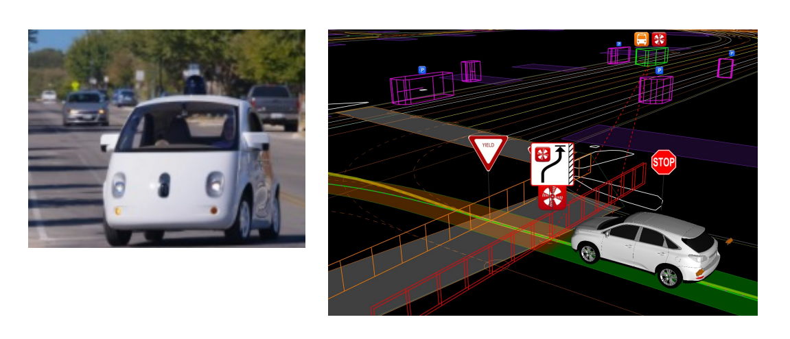
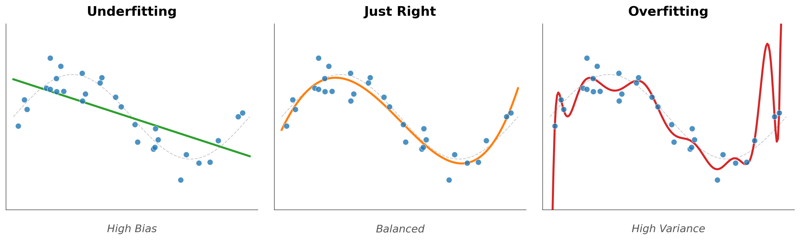
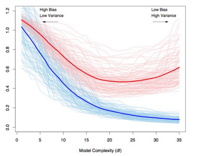
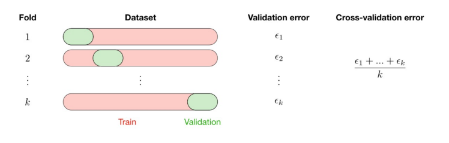
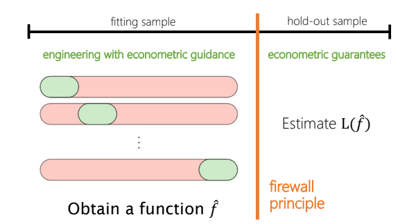
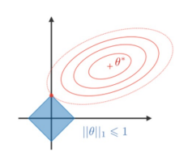
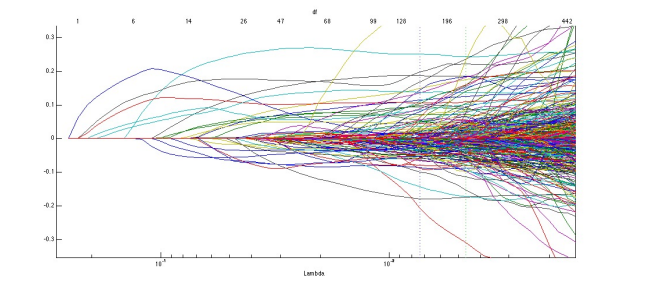
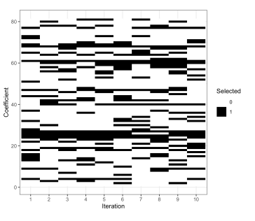
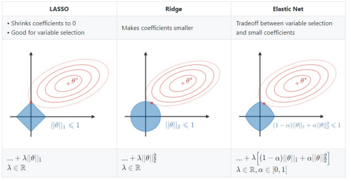

# Introduction

## Today's Big Picture

::: {.callout-note appearance="simple"}
## The Transition
We've spent Unit 1 asking **"Does it work?"** using experimental design.

Now we begin asking the same question with **observational data** — using machine learning as a tool for causal inference.
:::

. . .

**Today's role for ML**: Not prediction for its own sake, but prediction as a **building block** for causal estimation.

## Session Roadmap

:::: {.columns}
::: {.column width="50%"}
### Part 1: ML Foundations
- What ML is (and isn't)
- Prediction vs. causation
- Bias-variance tradeoff
- Cross-validation
:::

::: {.column width="50%"}
### Part 2: Regression in High Dimensions
- The high-dimensional problem
- LASSO: constrained minimization
- LASSO selection and instability
- Ridge, LASSO, and Elastic Net
:::
::::

---

# Why Machine Learning?

## ML is Already Everywhere

:::: {.columns}
::: {.column width="50%"}
### Translation

{width="500"}
:::

::: {.column width="50%"}
### Self-Driving Cars

{width="500"}
:::
::::

. . .

> **These advances share a common foundation**: learning patterns from data to make predictions

---

## The Key Insight

**Traditional programming:**

```
Rules + Data → Answers
```

. . .

**Machine learning:**

```
Data + Answers → Rules (learned patterns)
```

. . .

> ML discovers patterns from examples, rather than being explicitly told the rules

---

## ML vs Statistics vs Econometrics

| Approach | Primary Goal | Focus | Key Question |
|----------|--------------|-------|--------------|
| **Statistics** | Inference | Uncertainty | What is the relationship? |
| **Econometrics** | Causation | Identification | Does X *cause* Y? |
| **Machine Learning** | Prediction | Performance | What will Y be? |

. . .

::: {.callout-tip appearance="simple"}
## The Punchline for This Course
Modern causal inference uses ML for **prediction** tasks that serve **causal** goals. ML handles the hard prediction parts so we can focus on identification.
:::

---

# Prediction vs. Causation

## Two Different Goals {.smaller}

:::: {.columns}
::: {.column width="50%"}
### Econometrics: β-hard Problems
**Goal**: Understand $\hat{\beta}$ (coefficients)

- "Does X cause Y?"
- Hypothesis testing
- Causal interpretation
- **Unbiasedness** matters most
:::

::: {.column width="50%"}
### Machine Learning: Y-hard Problems
**Goal**: Accurate $\hat{y}$ (predictions)

- "What will Y be?"
- Minimize forecast error
- Out-of-sample performance
- **Prediction accuracy** matters most
:::
::::

. . .

> This distinction — from [Mullainathan & Spiess (2017)](https://doi.org/10.1257/jep.31.2.87) — is fundamental to understanding why ML matters for causal inference.

---

## When Prediction is Enough

Many important problems only require good predictions:

| Domain | Prediction Task | No Causation Needed |
|--------|-----------------|---------------------|
| **Email** | Spam or not? | Just filter accurately |
| **Credit** | Will they default? | Just rank risk |
| **Nutrition** | Who is food insecure? | Just target benefits |
| **Diagnosis** | Which disease? | Just classify correctly |

. . .

> But for **policy evaluation** — "Does this intervention work?" — we need causal inference.

---

## The SNAP Benefits Targeting Example

**Policy Problem**: How do we identify households most in need of nutrition assistance?

. . .

:::: {.columns}
::: {.column width="50%"}
### What We Have
- Demographic data
- Household composition
- Income proxies
- Food expenditure patterns
- Geographic indicators
:::

::: {.column width="50%"}
### What We Need
- Predict food insecurity
- Identify households most in need
- Direct nutrition benefits efficiently
:::
::::

. . .

> ML can predict food insecurity better than simple eligibility rules — enabling better targeting of SNAP and nutrition benefits. This is pure **Y-hard**.

---

## But What About Policy Questions?

::: {.callout-important appearance="simple"}
## The Causal Question
"Does a conditional cash transfer program **reduce** childhood malnutrition?"

This is **β-hard** — we need a causal effect, not just a prediction.
:::

. . .

**So why are we learning ML in a causal inference course?**

. . .

Because modern causal methods use ML for the **prediction sub-tasks** inside causal estimation:

1. Predicting outcomes: $\hat{E}[Y|X]$
2. Predicting treatment: $\hat{P}(D=1|X)$ (propensity score)

These are called **nuisance functions** — more on this later.

---

# The Bias-Variance Tradeoff

## The Central Challenge: Overfitting

{fig-align="center" width="700"}

- **Underfitting**: Model too simple, misses real patterns (high bias)
- **Overfitting**: Model too complex, memorizes noise (high variance)
- **Sweet spot**: Captures signal, ignores noise

---

## The Bias-Variance Tradeoff

{fig-align="center" width="500"}

. . .

- **Training error** always decreases with complexity
- **Test error** eventually increases (overfitting!)
- **Goal**: Find the complexity that minimizes **test error**

---

## Formal Decomposition

For any estimator $\hat{f}$ of the true function $f$:

$$E\left[(Y - \hat{f}(X))^2\right] = \underbrace{\text{Bias}^2(\hat{f})}_{\text{systematic error}} + \underbrace{\text{Var}(\hat{f})}_{\text{estimation noise}} + \underbrace{\sigma^2}_{\text{irreducible}}$$

**Irreducible error** ($\sigma^2$): The variance of the noise $\varepsilon$ in $Y = f(X) + \varepsilon$. This is inherent randomness in the data that **no model can reduce**, even with infinite data.

. . .

| Component | Increases with | Decreases with |
|-----------|---------------|----------------|
| **Bias²** | Simplicity | Complexity |
| **Variance** | Complexity | Simplicity |
| **Irreducible** | — | — |

. . .

> The optimal model minimizes the **sum** of bias² and variance — not either alone.

---

## Basic ML Setup

1. **Flexible functional forms** — let data determine the shape
2. **Limit expressiveness via regularization** — prevent overfitting
3. **Learn how much to regularize via tuning** — cross-validation

::: fragment
- What do these features imply about properties of $\hat{f}$?
- How can we use $\hat{f}$ in applied data analyses?
:::

---

## The Polynomial Example

Consider predicting $y$ from a single feature $x$:

| Degree | Model | Risk |
|--------|-------|------|
| 1 | $y = \beta_0 + \beta_1 x$ | Underfitting (high bias) |
| 3 | $y = \beta_0 + \beta_1 x + \beta_2 x^2 + \beta_3 x^3$ | May be right |
| 10 | $y = \sum_{j=0}^{10} \beta_j x^j$ | Overfitting (high variance) |

. . .

::: {.callout-warning appearance="simple"}
**The model that fits training data best is NOT always the best predictor.** An overfit model memorizes training data (including noise) and fails on new data.
:::

::: {.callout-tip appearance="simple"}
**Try it yourself**: [Open Overfitting Simulation in Colab](https://colab.research.google.com/github/unc-hpm-quant/HPM883-Spring2026/blob/main/notebooks/overfitting-simulation.ipynb)
:::

---

## Types of Machine Learning

| Type | Goal | Example |
|------|------|---------|
| **Supervised** | Learn f(X) → Y from labeled data | Predict health costs from claims |
| Unsupervised | Find structure in unlabeled data | Cluster patient phenotypes |
| Reinforcement | Learn optimal actions via rewards | Adaptive treatment rules |

> **Our focus**: Supervised learning — we have outcomes (Y) and want to predict them well.

---

## Three Components of a Supervised Learner

1. **A function class** $\mathcal{F}$ — the set of candidate models
   - Linear models, polynomials, trees, neural nets...

2. **A regularizer** — how we control complexity
   - L1 (LASSO), L2 (Ridge), tree depth, dropout...

3. **An optimization algorithm** — how we search for the best model
   - Gradient descent, coordinate descent, greedy splitting...

> Every ML method is a choice of these three components.

---

# Cross-Validation

## The Train/Test Split

{fig-align="center" width="700"}

1. **Training**: Learn patterns from data
2. **Validation**: Compare models, tune complexity
3. **Test**: Final, unbiased evaluation

. . .

> **Golden Rule**: Never touch test data until the very end!

---

## K-Fold Cross-Validation

More robust than a single train/validation split:

{fig-align="center" width="500"}

. . .

**Process**:

1. Split training data into K folds
2. Train on K-1 folds, validate on remaining fold
3. Repeat K times, rotating the validation fold
4. Average the results

---

## Why Cross-Validation Works

:::: {.columns}
::: {.column width="50%"}
### Single Split
- Depends on random split
- Validation set may be "lucky"
- Unstable estimates
:::

::: {.column width="50%"}
### K-Fold CV
- Uses all data for validation
- Averages across multiple splits
- More reliable estimates
:::
::::

. . .

> **Rule of thumb**: 5-fold or 10-fold CV is standard practice

::: {.callout-tip appearance="simple"}
## Why This Matters for DML
Cross-validation isn't just for model selection. In Double ML, we use a specific form called **cross-fitting** (sample splitting) to avoid overfitting bias in causal estimation. More in later sessions.
:::

---

## Full ML Exercise

{fig-align="center" width="700"}

---

# Regularization

## The Regularization Spectrum: Controlling Complexity

```
       No Regularization ──────────────────── Strong Regularization
       (Overfit)                                        (Underfit)

 OLS ──── Elastic Net ──── Ridge ──── LASSO ──── Null Model
```

- **Fewer constraints** → more flexible → risk overfitting
- **More constraints** → less flexible → risk underfitting
- **Cross-validation** tells us where to sit on this spectrum

---

## The High-Dimensional Problem

$$\hat{y} = \beta_0 + \beta_1 x_1 + \beta_2 x_2 + ... + \beta_p x_p$$

**Problem with OLS when p is large:**

- Many features relative to observations
- Overfitting: model fits noise, not signal
- Coefficients become unstable

. . .

**Solution**: Add a **penalty** that constrains coefficients — especially **LASSO**, which performs automatic variable selection

---

## Lasso Regression: Constrained Minimization

::: nonincremental
**Objective**: Minimize the sum of squared errors while keeping coefficients small
:::

::::: columns
::: {.column width="40%"}
### Constrained Form

$$
\begin{align}
\min_{\beta} &\sum_{i=1}^{n} \left(y_i - \beta_0 - \sum_{j=1}^{p} \beta_j x_{ij}\right)^2\\
\text{subject to } &\sum_{j=1}^{p} |\beta_j| \leq t
\end{align}
$$

- $t \geq 0$ is the constraint parameter
- Smaller $t$ means more regularization
- $t = 0$ forces all $\beta_j = 0$
:::

::: {.column width="60%"}
{width="100%"}

*Contours of RSS function and lasso constraint region (diamond). Solution occurs at corners, forcing coefficients to zero.*
:::
:::::

---

## Lasso: Lagrangian Form

$$
\min_{\beta} \sum_{i=1}^{n} \left(y_i - \beta_0 - \sum_{j=1}^{p} \beta_j x_{ij}\right)^2 + \lambda \sum_{j=1}^{p} |\beta_j|
$$

- $\lambda \geq 0$ is the penalty parameter
- $\lambda$ and $t$ have an inverse relationship
- As $\lambda \rightarrow \infty$, all $\beta_j \rightarrow 0$

---

## Lasso Lambda and Coefficient Paths

{fig-align="center" width="600"}

---

## The Lasso Selection Problem

::: nonincremental
**Challenge**: Different regularization paths can lead to different selected variables
:::

::: fragment
**OLS:**\
Health = β₀ + β₁·Age + β₂·Income + β₃·Education + β₄·SES + ... + βₙ·X_n + ε
:::

::: fragment
**Lasso (1):**\
Health = β₀ + β₁·Age + β₂·Income + β₃·Education + [β₄·SES]{style="color: grey;"} + ... + βₙ·X_n + ε
:::

::: fragment
**Lasso (2):**\
Health = β₀ + β₁·Age + [β₂·Income + β₃·Education]{style="color: grey;"} + β₄·SES + ... + βₙ·X_n + ε
:::

---

## Lasso Selection Problem — Key Implications

**Key implications:**

- Variable selection depends heavily on choice of λ
- Highly correlated predictors compete for selection
- Different random seeds in cross-validation → different final models
- Selection can be unstable with small changes in data

---

## Lasso Selection Instability

::::: columns
::: {.column width="60%"}
Lasso variable selection often exhibits **instability** across different runs, even on the same dataset:

- Small changes in data can lead to completely different sets of selected variables
- Highly correlated predictors compete for selection
- Cross-validation randomness affects final model composition
- Bootstrapping or repeated CV shows selection frequencies

**Implications for practice:**

- Single Lasso runs may miss important variables
- Ensemble approaches can provide more stable selection
- Variable selection consistency is not guaranteed
:::

::: {.column width="40%"}

:::
:::::

---

## Why Lasso Performs Variable Selection

::: nonincremental
The L1 penalty's diamond shape makes it likely for solutions to occur at corners where some $\beta_j = 0$
:::

::::: columns
::: {.column width="35%"}
- Solution occurs where RSS contours touch constraint region
- **LASSO (diamond)**: Corners intersect axes → some coefficients exactly zero
- **Ridge (circle)**: No corners → coefficients shrink but never zero
- **Elastic Net**: Compromise between L1 and L2
:::

::: {.column width="65%"}
{width="100%"}

*Comparison of LASSO (diamond) vs. Ridge (circle) vs. Elastic Net constraint regions.*
:::
:::::

---

# Key Takeaways

## Summary

1. **ML is about prediction** ($\hat{y}$), not causation ($\hat{\beta}$) — but prediction serves causal goals

2. **The bias-variance tradeoff** governs all ML — balance complexity with regularization

3. **Cross-validation** is how we honestly evaluate model performance

4. **LASSO** performs automatic variable selection via L1 penalty, but selection is unstable

5. **Ridge, LASSO, and Elastic Net** represent a spectrum of regularization strategies

6. **Next**: Tree-based methods, then how ML serves causal inference via DML

---

## Preparation for Next Session

::: {.callout-note appearance="simple"}
## Next: Tree-Based Methods and Ensemble Learning

**Read before next class:**

- ISLR Chapter 8: Tree-Based Methods
- Athey & Imbens (2019): "Machine Learning Methods Economists Should Know About" (Sections on Trees)

**Key question to think about:**

*How do tree-based methods handle non-linearities and interactions that LASSO cannot capture?*
:::

---

## Reminders

- **PS1 due Wednesday Feb 18** at 11:15am via GitHub Classroom
- Questions about PS1? Office hours Monday after class or by appointment
- Next session (Wed Feb 18): **Tree-Based Methods and Ensemble Learning**

---

## Additional Resources

### ML Foundations
- [ISLR Online](https://www.statlearning.com/) — Free textbook with R labs
- Mullainathan & Spiess (2017) — "Machine Learning: An Applied Econometric Approach" *JEP*
- Athey & Imbens (2019) — "Machine Learning Methods Economists Should Know About"

### R Packages for This Unit
- [`glmnet`](https://glmnet.stanford.edu/) — LASSO and Ridge regression
- [`ranger`](https://github.com/imbs-hl/ranger) — Fast Random Forest
- [`xgboost`](https://xgboost.readthedocs.io/) — Gradient Boosting
- [`DoubleML`](https://docs.doubleml.org/) — Double Machine Learning framework
- [`grf`](https://grf-labs.github.io/grf/) — Generalized Random Forests (causal forests)
