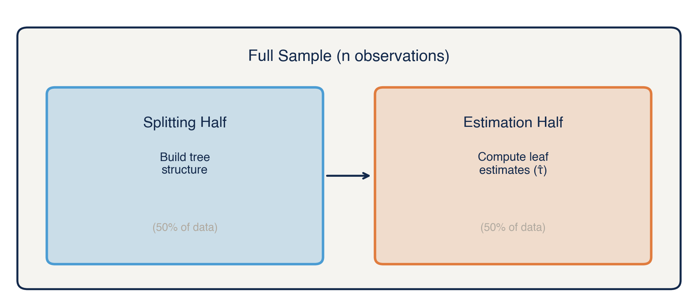
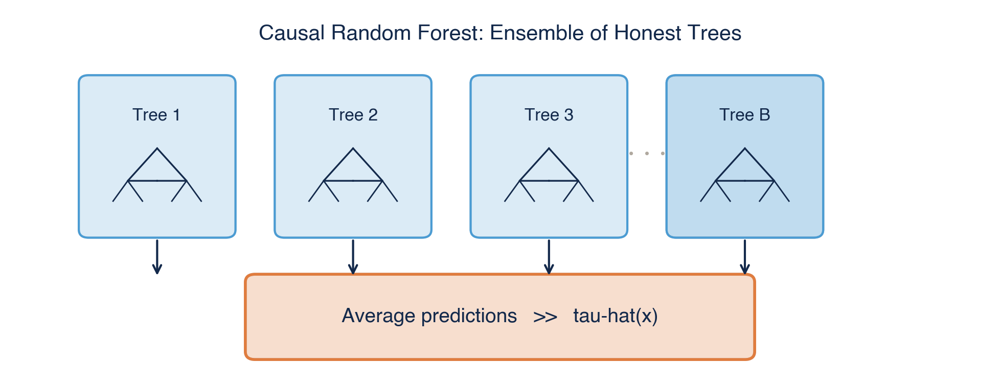
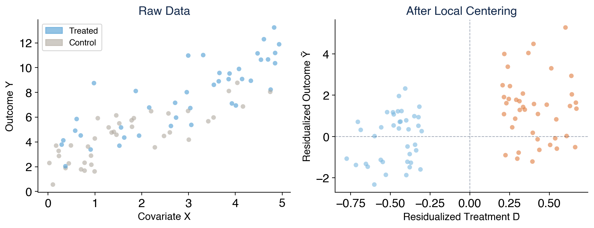

# Introduction

## The Shift

::: {.callout-note appearance="simple"}
## The Arc of the Course

**Unit 1 (Weeks 1-3):** Experimental Design — *"Does it work?"*

**Unit 2 (Weeks 4-10):** DML & Doubly-Robust Estimation — *"Does it work?"* (with ML)

**→ Unit 3 (Weeks 10-11):** Causal Forests & Meta-Learners — *"For whom does it work?"*

**Unit 4 (Week 11):** Policy Learning — *"What should we do?"*

**Unit 5 (Week 12):** Adaptive Experiments — *"What should we do?"* (dynamically)
:::

## Why "For Whom?"

Suppose a new health intervention reduces hospitalizations by 15% on average.

::: fragment
Should we roll it out to everyone?
:::

::: fragment
Maybe. But what if:

-   It reduces hospitalizations by **40%** for patients with multiple comorbidities
-   It has **no effect** on young, healthy patients
-   It actually **increases** costs for a subgroup due to side effects
:::

::: fragment
The **average** hides crucial variation. Policy needs to know **who benefits**.
:::

------------------------------------------------------------------------

## From ATE to CATE

**Average Treatment Effect (Unit 2):**

$$\tau = E[Y(1) - Y(0)]$$

::: fragment
**Conditional Average Treatment Effect (Unit 3):**

$$\tau(x) = E[Y(1) - Y(0) \mid X = x]$$
:::

::: fragment
$\tau(x)$ is the treatment effect for individuals with characteristics $x$.
:::

:::: fragment
::: smaller
| Estimand | Question | Example |
|-------------------------|-------------------------|-----------------------|
| ATE | Does it work on average? | "Reduces ER visits by 2.3/yr" |
| CATE | Does it work for *this person*? | "For diabetic 65+, reduction is 5.1" |
:::
::::

:::: fragment
::: {.callout-tip appearance="simple"}
The ATE is a **summary** of CATEs: $\tau = E[\tau(X)]$
:::
::::

------------------------------------------------------------------------

## Two Approaches to Exploring Heterogeneity

All heterogeneity analysis should be **theory-driven to some extent** — you need domain knowledge to formulate meaningful hypotheses. But the tools differ in how much the data guides the search.

:::::: fragment
::::: columns
::: {.column width="48%"}
### Theory-Driven (Traditional)

-   Pre-specify subgroups from theory
-   Interaction terms: $D \times X_j$
-   Guided by clinical/economic reasoning
-   **Strength:** Interpretable, pre-registerable
-   **Best for:** Confirmatory analysis
:::

::: {.column width="48%"}
### Data-Driven (Causal Forests)

-   Let the algorithm find heterogeneity
-   Forest splits on all covariates jointly
-   Guided by statistical patterns in data
-   **Strength:** Discovers unexpected patterns
-   **Best for:** Exploratory analysis
:::
:::::
::::::

:::: fragment
::: {.callout-tip appearance="simple"}
## Complementary, Not Competing

**Best practice:** Use both. Theory-driven analysis tests specific hypotheses. Data-driven analysis explores what you might have missed. Together, they give a more complete picture.
:::
::::

------------------------------------------------------------------------

## Pitfalls of Purely Data-Driven Subgroup Analysis

Even when theory motivates your subgroups, the traditional approach has well-known pitfalls:

::: fragment
1.  **Data dredging:** With 20 covariates, there are millions of possible subgroups. Some will show "significant" effects by chance.
:::

::: fragment
2.  **Multiple testing:** Standard CIs don't account for searching across subgroups. A "significant" subgroup effect may be noise.
:::

::: fragment
3.  **Curse of dimensionality:** Interactions between 3+ variables create tiny cells with unreliable estimates.
:::

::: fragment
4.  **Pre-specification paradox:** If you pre-specify subgroups, you miss unexpected heterogeneity. If you don't, you're data dredging.
:::

:::: fragment
::: {.callout-note appearance="simple"}
## What We Need

A principled data-driven method that discovers heterogeneity without overfitting — and produces valid inference. That's what **causal forests** provide.
:::
::::

------------------------------------------------------------------------

# Part 1: From Trees to Causal Trees {.center}

## Quick Recap: Random Forests (Session 2.1b)

Before we get to *causal* forests, let's recall **prediction** forests.

::::: columns
::: {.column width="48%"}
**Decision Trees** (single tree):

-   Recursively partition feature space
-   Splits maximize reduction in MSE
-   Predictions = averages within leaves
-   **Problem:** Unstable — small data changes → very different tree
:::

::: {.column width="48%"}
**Random Forests** (many trees):

-   Build $B$ trees on bootstrap samples
-   Each split considers random subset of features
-   Average predictions across all trees
-   **Result:** Stable, low-variance predictions
:::
:::::

:::: fragment
::: {.callout-note appearance="simple"}
Random forests are excellent **prediction** machines. But prediction ≠ causal inference. We need to adapt the forest idea for **treatment effects**.
:::
::::

------------------------------------------------------------------------

## From Prediction Forests to Causal Forests

|   | Prediction Forest | Causal Forest |
|------------------------|------------------------|------------------------|
| **Goal** | Predict $Y$ | Predict $\tau(X) = E[Y(1) - Y(0) \mid X]$ |
| **Split criterion** | Minimize prediction error | Maximize treatment effect heterogeneity |
| **What's in a leaf** | $\bar{Y}$ (mean outcome) | $\hat\tau$ (estimated treatment effect) |
| **Key innovation** | Bagging + feature subsampling | \+ Honest splitting + local centering |

::: fragment
For **prediction** trees, the split criterion minimizes prediction error:

$$\text{Split to minimize:} \quad \sum_{i \in \text{left}} (Y_i - \bar{Y}_L)^2 + \sum_{i \in \text{right}} (Y_i - \bar{Y}_R)^2$$
:::

::: fragment
**Key idea for today:** What if, instead of predicting $Y$, we want to predict $\tau(X)$ — the *treatment effect*?
:::

------------------------------------------------------------------------

## Causal Trees: The Intuition

**Goal:** Partition the covariate space so that leaves contain groups with *similar treatment effects*.

::: fragment
**Naive approach:** Build a tree where the split criterion maximizes the *difference in treatment effects* between child nodes.
:::

::: fragment
$$\text{Split to maximize:} \quad (\hat\tau_L - \hat\tau_R)^2$$

where $\hat\tau_L = \bar{Y}_{L,\text{treated}} - \bar{Y}_{L,\text{control}}$
:::

::: fragment
**Problem:** If we use the same data to:

1.  **Choose** where to split (find the partition), and
2.  **Estimate** the treatment effect within each leaf
:::

::: fragment
...we get **overfitting**. The tree will find splits that maximize *apparent* heterogeneity, even if it's noise.
:::

------------------------------------------------------------------------

## The Honesty Principle

**Athey & Imbens (2016)** introduced a solution: **honest estimation**.

:::: fragment
::: {.callout-note appearance="simple"}
**Remember Session 2.2?** We saw that "honesty" — separating model building from estimation — is a general principle in causal ML. Cross-fitting in DML was our first encounter. Now we apply the same idea *within* trees.
:::
::::

::: fragment
Split your data into two halves:

{fig-alt="Diagram showing the full sample split into a Splitting Half (builds tree structure) and an Estimation Half (computes leaf estimates)" width="85%"}
:::

:::: fragment
::: {.callout-tip appearance="simple"}
## Why This Works

The estimation sample never influenced the splits. So the leaf estimates are **unbiased** — no overfitting to the tree structure.
:::
::::

------------------------------------------------------------------------

## Honest Trees: Step by Step

**Step 1:** Randomly split data 50/50 into splitting ($\mathcal{S}$) and estimation ($\mathcal{E}$) samples.

::: fragment
**Step 2:** Using $\mathcal{S}$ only, grow a tree that maximizes treatment effect heterogeneity across leaves.
:::

::: fragment
**Step 3:** Drop the leaf estimates from $\mathcal{S}$. Push $\mathcal{E}$ observations through the tree structure.
:::

::: fragment
**Step 4:** In each leaf $\ell$, estimate: $$\hat\tau_\ell = \frac{1}{n_{\ell,1}} \sum_{i \in \ell: D_i=1} Y_i - \frac{1}{n_{\ell,0}} \sum_{i \in \ell: D_i=0} Y_i$$

using only estimation-sample observations that fall in leaf $\ell$.
:::

::: fragment
**Step 5:** For a new observation with $X = x$, find its leaf and report $\hat\tau(x) = \hat\tau_\ell$.
:::

------------------------------------------------------------------------

# Part 2: Causal Random Forests {.center}

::: {.callout-note appearance="minimal"}
**Key Papers:** Athey, Tibshirani & Wager (2019); Wager & Athey (2018)
:::

## From One Tree to a Forest

A single honest causal tree is:

-   **Noisy** — depends heavily on the random split
-   **High variance** — small changes in data → very different tree
-   **Coarse** — can only assign a few distinct $\hat\tau$ values (one per leaf)

::: fragment
**Solution:** Build a **forest** of many causal trees.
:::

::: fragment
Each tree uses:

-   A random subsample of the data
-   A random subset of features at each split
-   Honest splitting (separate estimation sample)
:::

::: fragment
The forest prediction: **average across all trees**

$$\hat\tau(x) = \frac{1}{B} \sum_{b=1}^{B} \hat\tau_b(x)$$
:::

::: fragment
{fig-alt="Diagram showing multiple honest trees averaged into a single CATE prediction" width="80%"}

This is the same idea as a random forest for prediction — but adapted for *treatment effects*.
:::

------------------------------------------------------------------------

## What Makes Causal Forests Special?

Three key innovations beyond standard random forests:

::: fragment
### 1. Honesty

Every tree uses separate samples for splitting and estimation. This ensures valid inference (not just good prediction).
:::

::: fragment
### 2. Local Centering (next slide)
:::

::: fragment
### 3. Forest-Based Inference

The forest structure provides **asymptotically valid confidence intervals** for $\hat\tau(x)$ — no bootstrap needed.
:::

------------------------------------------------------------------------

## Local Centering: The Intuition

**Problem:** The raw outcome $Y$ depends on *both* the treatment effect AND baseline characteristics. If sicker patients have higher outcomes regardless of treatment, the forest might confuse "high baseline" with "high treatment effect."

::: fragment
**Solution:** Remove the predictable part of the outcome and treatment before building the forest.
:::

::: fragment
**Step 1 — Predict the baseline outcome:** Fit a model $\hat{m}(X) = E[Y \mid X]$ (ignoring treatment). This captures what we'd expect the outcome to be based on covariates alone.
:::

::: fragment
**Step 2 — Predict treatment probability:** Fit a model $\hat{e}(X) = P(D = 1 \mid X)$. In an RCT with 50/50 assignment, this is just 0.5 for everyone.
:::

::: fragment
**Step 3 — Compute residuals:** Subtract the predictions:

$$\tilde{Y}_i = Y_i - \hat{m}(X_i) \qquad \tilde{D}_i = D_i - \hat{e}(X_i)$$

Now $\tilde{Y}$ is "outcome variation not explained by covariates" and $\tilde{D}$ is "treatment variation not explained by covariates."
:::

::: fragment
**Step 4 — Build the forest on residuals.** The forest now focuses purely on how treatment *effects* vary, not how outcomes or treatment assignment vary.
:::

------------------------------------------------------------------------

## Local Centering = Orthogonalization from DML

::: {.callout-tip appearance="simple"}
## Unit 2 → Unit 3 Bridge

This is the **same orthogonalization** from Double ML! In Unit 2, we partialled out confounders to estimate the ATE. Here, we partial out confounders so the forest can estimate *heterogeneous* effects.
:::

::: fragment
{fig-alt="Side-by-side comparison: raw data showing treated vs control, and residualized data after local centering" width="85%"}
:::

::: fragment
**Left:** Raw data — hard to see treatment effects because baseline outcome variation dominates.

**Right:** After local centering — the relationship between residualized treatment and residualized outcome reveals the treatment effect signal.
:::

------------------------------------------------------------------------

## Local Centering: The DR Score Connection

Local centering in causal forests uses the **same doubly-robust scores** you learned in Unit 2.

::: fragment
Recall the AIPW score for observation $i$:

$$\hat\phi_i = \hat\mu_1(X_i) - \hat\mu_0(X_i) + \frac{D_i(Y_i - \hat\mu_1(X_i))}{\hat\pi(X_i)} - \frac{(1-D_i)(Y_i - \hat\mu_0(X_i))}{1-\hat\pi(X_i)}$$
:::

::: fragment
In Unit 2, we averaged these scores to get the ATE: $\hat\tau = \frac{1}{n}\sum_i \hat\phi_i$
:::

::: fragment
**Causal forests do something different:** they estimate how $\hat\phi_i$ varies as a function of $X_i$.
:::

::: fragment
Instead of one global average, we get a **local average** — the CATE:

$$\hat\tau(x) = \sum_{i=1}^n \alpha_i(x) \cdot \hat\phi_i$$

where $\alpha_i(x)$ are forest-derived **adaptive nearest-neighbor weights**.
:::

------------------------------------------------------------------------

## How the Forest Creates Weights

For a new point $x$, the forest computes weights $\alpha_i(x)$:

::: fragment
1.  For each tree $b$, find the leaf containing $x$
2.  All training observations in that leaf are "neighbors" of $x$ in tree $b$
3.  Each neighbor gets weight $1/n_\ell$ (where $n_\ell$ is the leaf size)
4.  Average weights across all $B$ trees
:::

::: fragment
$$\alpha_i(x) = \frac{1}{B} \sum_{b=1}^{B} \frac{\mathbb{1}(X_i \in L_b(x))}{|L_b(x)|}$$
:::

::: fragment
**Intuition:** Observations that frequently end up in the same leaf as $x$ are "similar" — they get higher weight. The forest *adaptively* defines neighborhoods.
:::

:::: fragment
::: {.callout-tip appearance="simple"}
A causal forest is a **locally weighted doubly-robust estimator** where the weights are learned from the data.
:::
::::

------------------------------------------------------------------------

# Part 3: The `grf` Package {.center}

## Causal Forests in R

::: {.callout-note appearance="simple"}
**Code-along notebook:** Full worked example with the GRF analysis pipeline

- [Open in Posit Cloud](causal-forests-demo.qmd) (recommended — R environment ready)
- [Open in Google Colab](https://colab.research.google.com/github/unc-hpm-quant/HPM883-Spring2026/blob/main/unit-3/causal-forests-demo.ipynb) (requires R kernel setup)
- [View as HTML](causal-forests-demo.html) (read-only reference)
:::

The `grf` package (Generalized Random Forests) makes this easy:

```{r}
#| eval: false
#| echo: true

library(grf)

# Fit a causal forest
cf <- causal_forest(
  X = X,           # Covariate matrix (n × p)
  Y = Y,           # Outcome vector
  W = W,           # Treatment indicator (0/1)
  num.trees = 2000 # Number of trees
)

# Predict CATEs for all observations
tau_hat <- predict(cf)$predictions

# Get confidence intervals
ci <- predict(cf, estimate.variance = TRUE)
ci$lower <- ci$predictions - 1.96 * sqrt(ci$variance.estimates)
ci$upper <- ci$predictions + 1.96 * sqrt(ci$variance.estimates)
```

::: fragment
That's it. Under the hood, `grf` handles honesty, local centering, and forest-based inference automatically.
:::

------------------------------------------------------------------------

## Key `grf` Functions

| Function                     | Purpose                                 |
|------------------------------|-----------------------------------------|
| `causal_forest()`            | Fit a causal forest                     |
| `predict()`                  | Estimate CATEs (with optional variance) |
| `average_treatment_effect()` | Forest-weighted ATE (doubly robust)     |
| `test_calibration()`         | Test whether heterogeneity is real      |
| `variable_importance()`      | Which covariates drive HTE?             |
| `best_linear_projection()`   | Project CATEs onto selected covariates  |

::: fragment
### Testing for Heterogeneity

```{r}
#| eval: false
#| echo: true

# Is there real heterogeneity?
test_calibration(cf)
# Reports: mean.forest.prediction (should ≈ ATE)
#          differential.forest.prediction (>0 if real HTE)
```
:::

::: fragment
If the "differential" coefficient is significantly positive, the forest is detecting real treatment effect heterogeneity — not just noise.
:::

------------------------------------------------------------------------

## Variable Importance

```{r}
#| eval: false
#| echo: true

# Which variables drive heterogeneity?
vi <- variable_importance(cf)
names(vi) <- colnames(X)
sort(vi, decreasing = TRUE)[1:5]
```

::: fragment
**Interpretation:** Variables that appear more often in splits are more important for explaining *treatment effect variation* (not outcome prediction).
:::

:::: fragment
::: {.callout-warning appearance="simple"}
## Caution

Variable importance tells you which variables the forest uses for splits, but it doesn't tell you the *direction* or *magnitude* of the effect. Use `best_linear_projection()` for interpretable summaries.
:::
::::

------------------------------------------------------------------------

## Best Linear Projection

```{r}
#| eval: false
#| echo: true

# Project CATEs onto interpretable covariates
blp <- best_linear_projection(cf, A = X[, c("age", "comorbidity_count")])
print(blp)
```

::: fragment
This fits: $\hat\tau(x) \approx \beta_0 + \beta_1 \cdot \text{age} + \beta_2 \cdot \text{comorbidities}$
:::

::: fragment
-   Gives you interpretable coefficients with standard errors
-   "Each additional comorbidity increases the treatment effect by 0.8 units (SE = 0.3)"
-   More robust than pre-specified subgroup analysis
:::

------------------------------------------------------------------------

# Part 3b: What to Do with CATEs {.center}

## The Full Analysis Pipeline

Estimating CATEs is just the first step. The key question: **now what?**

::: fragment
| Step | Method | Question |
|------------------|------------------------|------------------------------|
| 1\. Estimate | `causal_forest()` | What is each person's τ(x)? |
| 2\. Test | `test_calibration()` | Is the heterogeneity real? |
| 3\. Screen | `variable_importance()` | Which covariates matter? |
| 4\. Summarize | `best_linear_projection()` | How do covariates relate to CATEs? |
| 5\. Visualize | Sorted groups (GATES) | ATEs by CATE quintile |
| 6\. Characterize | CLAN analysis | Who is in each group? |
| 7\. Evaluate | RATE / AUTOC | Does targeting actually work? |
| 8\. Decide | `policy_tree()` | What's the optimal treatment rule? |
:::

:::: fragment
::: {.callout-tip appearance="simple"}
Steps 2-7 are the **Athey-Wager diagnostic framework**. Always do these before making policy recommendations.
:::
::::

------------------------------------------------------------------------

## Step 2: Is the Heterogeneity Real? (GATES)

Rank individuals by predicted CATE, split into quintiles, estimate the ATE within each group using doubly-robust (AIPW) scores.

::: fragment
```{r}
#| eval: false
#| echo: true

# Create quintile rankings (K-fold to avoid overfitting)
# Estimate AIPW-based ATE within each quintile
ols <- lm(aipw.scores ~ 0 + factor(ranking))
coeftest(ols, vcov = vcovHC(ols, "HC2"))
```
:::

::: fragment
**If Group 5 \>\> Group 1:** Real heterogeneity — the forest identifies who benefits most.

**If all groups ≈ equal:** Heterogeneity is weak or noise — proceed with caution.
:::

------------------------------------------------------------------------

## Step 6: Who is in Each Group? (CLAN)

Compare covariate means between the most-affected and least-affected groups.

::: fragment
```{r}
#| eval: false
#| echo: true

# Compare top quintile (most benefit) vs bottom quintile (least benefit)
mean_top    <- colMeans(X[ranking == 5, ])
mean_bottom <- colMeans(X[ranking == 1, ])
difference  <- mean_top - mean_bottom
```
:::

::: fragment
This tells you what **characterizes** high-benefit individuals.

Example: "Patients in the top group have 2.3 more comorbidities and are 12 years older on average."
:::

:::: fragment
::: {.callout-warning appearance="simple"}
CLAN is **descriptive**, not causal. It says who benefits, not why.
:::
::::

------------------------------------------------------------------------

## Step 7: Does Targeting Work? (RATE/AUTOC)

The **Rank-Average Treatment Effect** evaluates targeting quality.

::: fragment
```{r}
#| eval: false
#| echo: true

# Split-sample: train CATEs on one half, evaluate on the other
rate <- rank_average_treatment_effect(cf.eval, tau.hat.test)
plot(rate)  # TOC curve
```
:::

::: fragment
**TOC curve:** Treat individuals in order of predicted benefit (highest CATE first). The curve shows treatment effect advantage over random assignment.

-   **AUTOC \> 0** (p \< 0.05): Your targeting rule works
-   **Flat at zero:** No useful heterogeneity for targeting
:::

------------------------------------------------------------------------

# Part 4: Practical Considerations {.center}

## When Do Causal Forests Work Well?

**Good settings:**

-   Moderate to large sample sizes ($n > 500$, ideally $> 1000$)
-   Enough variation in treatment effects across $X$
-   Good overlap (same as Unit 2 — positivity matters)
-   Mix of continuous and categorical covariates

::: fragment
**Challenging settings:**

-   Very small samples (trees need enough observations per leaf)
-   Very high-dimensional $X$ with sparse signal
-   When heterogeneity is along a single variable (simpler methods work)
-   When treatment effects are near zero everywhere
:::

:::: fragment
::: {.callout-tip appearance="simple"}
## Rule of Thumb

If the ATE is near zero, be skeptical of large CATEs in subgroups — the forest may be finding noise.
:::
::::

------------------------------------------------------------------------

## Inference and Interpretation

**What the confidence intervals cover:**

-   The forest provides pointwise CIs for $\tau(x)$ at each $x$
-   These are valid asymptotically under regularity conditions
-   They account for the adaptive nature of the forest

::: fragment
**What they don't cover:**

-   Simultaneous coverage across all $x$ (no uniform bands)
-   Inference on which specific variables "matter" for HTE
:::

::: fragment
**Best practices:**

1.  **Always run `test_calibration()`** — check that heterogeneity is real
2.  **Report the ATE** alongside CATEs — how much variation is there?
3.  **Use `best_linear_projection()`** for interpretable HTE summaries
4.  **Check overlap** — extreme propensity scores mean unreliable CATEs in those regions
:::

------------------------------------------------------------------------

## Health Policy Application: Targeting

One of the most powerful applications of CATEs — **treatment targeting**:

::: fragment
1.  Estimate $\hat\tau(x)$ for all individuals in your sample
2.  Rank individuals by their predicted benefit
3.  Under a **budget constraint**, treat those with the highest CATEs
:::

::: fragment
**Example:** A community health worker intervention costs \$500/patient.

-   Average effect: 1.2 fewer ER visits ($\hat\tau = -1.2$)
-   Top quartile by CATE: 3.8 fewer ER visits ($\hat\tau = -3.8$)
-   Bottom quartile: 0.1 fewer ER visits ($\hat\tau = -0.1$)
:::

::: fragment
**Targeting the top quartile** achieves 3× the impact per dollar.
:::

:::: fragment
::: {.callout-note appearance="simple"}
This is a preview of **Unit 4 (Policy Learning)** — we'll formalize targeting with `policytree`.
:::
::::

------------------------------------------------------------------------

# Key Takeaways {.center}

## Summary

1.  **CATEs** ($\tau(x)$) capture treatment effect heterogeneity — the ATE is just an average of CATEs

2.  **Naive subgroup analysis** overfits — honest estimation is essential for valid HTE inference

3.  **Causal trees** use honest splitting (separate samples for structure and estimation)

4.  **Causal forests** aggregate many honest trees, with local centering (same DR scores from Unit 2) and forest-based inference

5.  **`grf` package** provides causal forests with automatic honesty, local centering, and valid CIs

6.  **Always test:** `test_calibration()` before interpreting heterogeneity patterns

------------------------------------------------------------------------

## What's Next

::: {.callout-note appearance="simple"}
## Coming Up

**Monday Mar 30: Jigsaw 3** — Expert groups present on causal forest application papers

-   Read your assigned Jigsaw 3 paper (posted on the [course website](https://hpm883.ssylvia.io))
-   Papers on causal forest applications in health economics

**Wednesday Apr 1: Lab** — Hands-on with causal forests (`grf`), meta-learners (T/S/X/R/DR-learner), and CATE estimation

**Problem Set 3** assigned this week — HTE & Causal Forests (due Apr 6)
:::

::: fragment
**Prep for Lab:**

-   Chernozhukov et al. (2025) — Ch. 8: Heterogeneous Treatment Effects
:::

------------------------------------------------------------------------

## Readings for Today's Topics

**Required:**

-   Wager (2024) — [Chapter 6: Causal Forests](http://web.stanford.edu/~swager/causal_inf_book.pdf)

**Recommended:**

-   Athey & Imbens (2016) — "Recursive Partitioning for Heterogeneous Causal Effects" (*PNAS*)
-   Athey, Tibshirani & Wager (2019) — "Generalized Random Forests" (*Annals of Statistics*)
-   Wager & Athey (2018) — "Estimation and Inference of Heterogeneous Treatment Effects using Random Forests" (*JASA*)
-   Davis & Heller (2017) — "Using Causal Forests to Predict Treatment Heterogeneity" (*AER P&P*)

------------------------------------------------------------------------

## Questions?

**Office hours:** By appointment — email or Canvas message