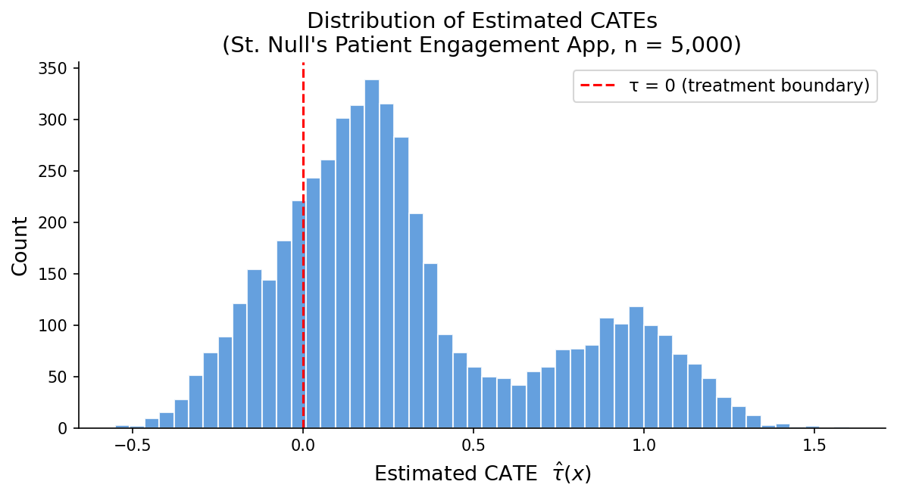
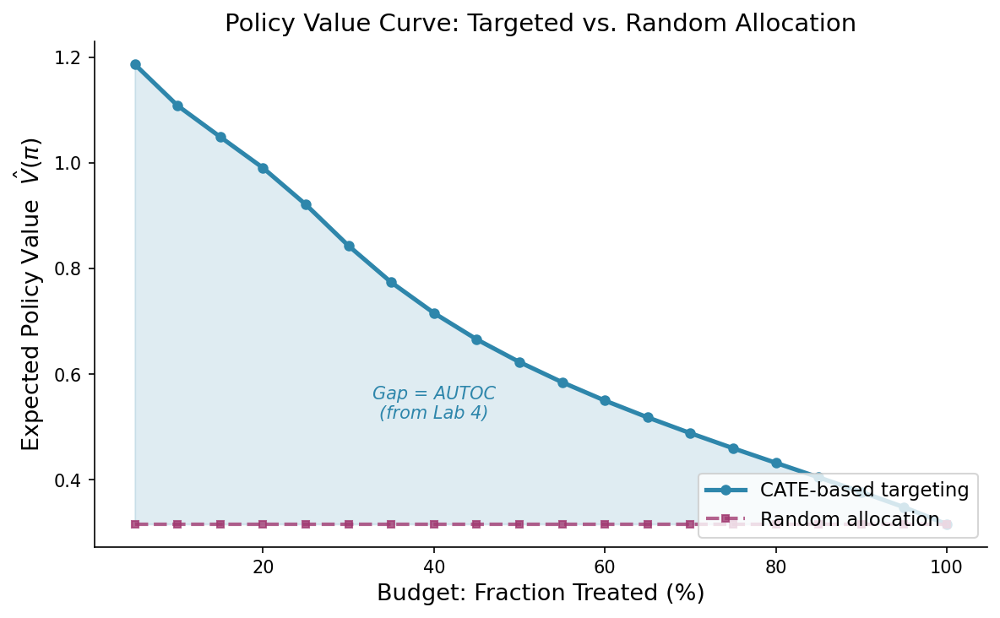

## Housekeeping

-   **Class is remote today** — welcome to Zoom
-   **PS 3 due today** (ok if need till end of week)
-   **PS 4 assigned today** — due Monday Apr 13
-   **Capstone draft paper** due Wed Apr 15 on Canvas (for peer review)
-   Fixing the PS 3 repo link issue some of you flagged Wednesday — email me if you still can't access the data

------------------------------------------------------------------------

## Capstone Draft Paper — Coming Up

Your **draft paper** is due **Wednesday April 15** on Canvas.

::: fragment
### What to submit

-   A **complete draft** of your capstone paper (PDF or rendered Quarto)
-   Does NOT need to be perfect — but should be complete enough for meaningful peer feedback
-   Submit via the **"Capstone Draft"** assignment on Canvas
:::

::: fragment
### What happens next

-   Canvas **automatically assigns one peer reviewer** when you submit
-   **Peer review due April 22** (1-2 pages of structured feedback)
-   You'll incorporate feedback into your **final package** (due May 1)
:::

::: fragment
### Your draft should include

1.  **Introduction & research question**
2.  **Data description** (simulated or real)
3.  **Methods** — which causal ML tools and why
4.  **Results** — (or anticipated)
:::

::: {.callout-tip appearance="simple"}
See the [Capstone Project page](../capstone.qmd) for full requirements and rubric.
:::

------------------------------------------------------------------------

## Previously on HPM 883

In Lab 4 (Wednesday):

::: fragment
1.  **Estimated CATEs** with `causal_forest()` on the CHW program data
:::

::: fragment
2.  **Tested calibration** — confirmed the heterogeneity was real (not noise)
:::

::: fragment
3.  **Ran the full diagnostic pipeline** — GATES, CLAN, RATE/AUTOC
:::

::: fragment
4.  **Previewed policy trees** — hit a syntax error and deferred the full treatment
:::

::: {.fragment .callout-note appearance="simple"}
## Today we pick up exactly there

Today we'll go deeper with policy trees!
:::

------------------------------------------------------------------------

## The Arc of the Course

::: {.callout-note appearance="simple"}
## Where we are

**Unit 1:** Experimental Design — *"Does it work?"*

**Unit 2:** DML & Doubly-Robust Estimation — *"Does it work?"* (with ML)

**Unit 3:** Causal Forests — *"For whom does it work?"*

**→ Unit 4 (today):** Policy Learning — *"What should we do?"*
:::

::: fragment
You now know how to estimate $\hat\tau(x)$ for every person in your data. The question today: **what do you do with it?**
:::

------------------------------------------------------------------------

# Part 1: From CATEs to Policies {.center}

## The Concrete Question

You're at St. Null's Memorial Hospital. You've estimated CATEs for a patient engagement app on 5,000 patients. Your CATE histogram looks like this:

::: fragment
{fig-alt="Histogram of estimated CATEs ranging from -0.5 to 1.5 with a large mass near zero and a secondary mode near 1.0" width="70%"}
:::

::: fragment
**CEO Barnaby Beta walks in:**

> "Great work. Now tell me — who should get the app?"
:::

::: fragment
What do you say?
:::

------------------------------------------------------------------------

## First Attempt: "Treat if the Benefit is Positive"

The obvious answer:

$$\pi_{\text{naive}}(x) = \mathbb{1}\{\hat\tau(x) > 0\}$$

::: fragment
**Intuition:** If we expect them to benefit on average, give them the treatment. If we expect them to lose, don't.
:::

::: fragment
This feels right. And under the right conditions, **it IS right**.
:::

------------------------------------------------------------------------

## The Optimal Policy (No Constraints)

If treatment is free, reversible, and there's no budget, the **first-best** policy is:

$$\pi^*(x) = \mathbb{1}\{\tau(x) > 0\}$$

::: fragment
**Proof sketch.** The policy value is

$$V(\pi) = \mathbb{E}\bigl[\,\pi(X)\cdot Y(1) + (1-\pi(X))\cdot Y(0)\,\bigr]$$

$$= \mathbb{E}[Y(0)] + \mathbb{E}[\pi(X) \cdot \tau(X)]$$
:::

::: fragment
To maximize $V(\pi)$, set $\pi(x) = 1$ exactly when $\tau(x) > 0$. Pointwise optimal.
:::

::: {.fragment .callout-tip appearance="simple"}
## The key move

We picked $\pi$ pointwise — at each $x$ independently — because $\tau(x)$ doesn't depend on what we do at other values of $X$.
:::

------------------------------------------------------------------------

## So Why Is This Hard?

Three reasons the first-best isn't what we actually deploy.

::: fragment
### 1. We don't know $\tau(x)$ — we have $\hat\tau(x)$

Noise in $\hat\tau$ means noise in the policy. Individuals near the $\tau(x) = 0$ boundary get flipped by estimation error.
:::

::: fragment
### 2. We often have a budget

"Treat everyone with $\hat\tau > 0$" might mean treating 3,000 people when you can only afford 1,200.
:::

::: fragment
### 3. We may need an interpretable rule

"Treat if the Medicare-trained XGBoost model outputs \> 0" is not a policy a program manager can explain to a patient, a board, or a regulator.
:::

------------------------------------------------------------------------

# Part 2: Value and Regret {.center}

## Scoring Policies

We already wrote the policy value:

$$V(\pi) = \mathbb{E}\bigl[\,Y(\pi(X))\,\bigr]$$

::: fragment
**Interpretation:** the expected outcome if we deployed $\pi$ to the whole population. Higher is better (for benefit outcomes).
:::

::: fragment
With a class of candidate policies $\Pi$, we want

$$\hat\pi \in \arg\max_{\pi \in \Pi} \hat V(\pi)$$
:::

::: fragment
But $V(\pi)$ has a scale that depends on the outcome. And optimizing it directly has tricky sample properties — bad finite-sample behavior.
:::

------------------------------------------------------------------------

## Regret: The Better Objective

**Policy regret** measures how much welfare you leave on the table relative to the first-best in your policy class:

$$R(\pi) = V(\pi^*_\Pi) - V(\pi), \qquad \pi^*_\Pi \in \arg\max_{\pi \in \Pi} V(\pi)$$

::: fragment
Smaller regret = better policy. Zero regret = you found the best-in-class.
:::

::: fragment
**Why regret has better sample properties:**

1.  It's **scale-free** (in a sense) — comparisons are differences, not levels
2.  It **cancels the baseline** $\mathbb{E}[Y(0)]$ that we can't control anyway
3.  **Regret bounds** are cleaner: Kitagawa & Tetenov (2018) derive $O(n^{-1/2})$ regret rates under mild conditions
:::

::: {.fragment .callout-note appearance="simple"}
Empirical Welfare Maximization (EWM) and policy trees both minimize sample regret, not sample value. The distinction matters theoretically even when the point estimates look similar.
:::

------------------------------------------------------------------------

## Why Not Just Use $\hat\tau(x) > 0$?

The naive policy has two problems:

::: fragment
### Problem 1: Estimation error

$$\pi_{\text{naive}}(x) = \mathbb{1}\{\hat\tau(x) > 0\}$$

With $\hat\tau$ noisy, this can flip sign near zero for reasons that have nothing to do with real benefit. You get a policy that's sensitive to the seed of your random forest.
:::

::: fragment
### Problem 2: It's not a policy class

An ML model output isn't interpretable, auditable, or portable. A clinic can't run your XGBoost model. A depth-2 tree? Anyone can read it.
:::

::: {.fragment .callout-tip appearance="simple"}
## The fix (coming up)

Score actions *directly* with doubly-robust scores, then learn a policy from a small interpretable class (like depth-2 trees) that minimizes sample regret.
:::

------------------------------------------------------------------------

# Part 3: Doubly-Robust Policy Scores {.center}

## Callback to Unit 2

Remember AIPW? Given an observation $(Y_i, W_i, X_i)$ with estimated nuisances $\hat\mu_w(x)$ and $\hat e(x)$:

$$\hat\phi_i = \hat\mu_1(X_i) - \hat\mu_0(X_i) + \frac{W_i\bigl(Y_i - \hat\mu_1(X_i)\bigr)}{\hat e(X_i)} - \frac{(1-W_i)\bigl(Y_i - \hat\mu_0(X_i)\bigr)}{1-\hat e(X_i)}$$

::: fragment
In Unit 2, we averaged these to get the ATE.
:::

::: fragment
In Unit 3, causal forests use them **locally** to get CATEs.
:::

::: fragment
Today, we use them **per action**.
:::

------------------------------------------------------------------------

## DR Score for Each Action

Split the AIPW influence into **two scores** — one per action:

$$\Gamma_{i,0} = \hat\mu_0(X_i) + \dfrac{\mathbb{1}\{W_i = 0\}}{1-\hat e(X_i)}\bigl(Y_i - \hat\mu_0(X_i)\bigr)$$

$$\Gamma_{i,1} = \hat\mu_1(X_i) + \dfrac{\mathbb{1}\{W_i = 1\}}{\hat e(X_i)}\bigl(Y_i - \hat\mu_1(X_i)\bigr)$$

::: fragment
Think of $\Gamma_{i,a}$ as an **unbiased estimate of** $Y_i(a)$ for person $i$.
:::

::: fragment
**Key property** (Neyman orthogonality): $\mathbb{E}[\Gamma_{i,a} \mid X_i] = \mu_a(X_i)$, even if $\hat\mu$ or $\hat e$ is wrong — as long as at least one is right.
:::

------------------------------------------------------------------------

## From DR Scores to Policy Value

Once you have DR scores, estimating the value of **any** policy $\pi$ is simple:

$$\hat V(\pi) = \frac{1}{n}\sum_{i=1}^n \Gamma_{i,\pi(X_i)}$$

::: fragment
Translation: for each person, look up the DR score of the action your policy assigns, and average.
:::

::: fragment
**This is the magic.** We no longer need $\hat\tau$ to be precisely estimated everywhere — we just need DR scores that are unbiased per action.
:::

::: fragment
And optimization becomes:

$$\hat\pi = \arg\max_{\pi \in \Pi} \frac{1}{n}\sum_{i=1}^n \Gamma_{i,\pi(X_i)}$$
:::

::: {.fragment .callout-tip appearance="simple"}
## The whole trick in one line

Score actions (not individuals), then pick the action with the higher score, subject to policy class constraints.
:::

------------------------------------------------------------------------

# Part 4: Policy Trees {.center}

## The Interpretability Constraint

Suppose $\Pi$ is the class of **depth-2 decision trees** on $X$. What's the best tree?

::: fragment
A depth-2 tree has at most 4 leaves. Each leaf assigns one action to everyone in it. The tree uses at most 3 split variables.
:::

::: fragment
**Example output:**

```         
if age > 55:
    if comorbidity_count > 2:
        treat
    else:
        don't treat
else:
    if digital_literacy > 0.6:
        treat
    else:
        don't treat
```
:::

::: fragment
A program manager can read this. A board can approve it. A clinic can deploy it. Your causal forest cannot.
:::

------------------------------------------------------------------------

## How Policy Trees Are Fit

Given DR scores $\Gamma_{i,0}, \Gamma_{i,1}$ for every observation:

::: fragment
1.  **For every possible tree** of the given depth — enumerate all splits on all variables
:::

::: fragment
2.  **Compute the value** $\hat V(\pi)$ for each candidate tree using the DR scores
:::

::: fragment
3.  **Return the tree** with the highest value
:::

::: fragment
That's **exact tree search** — the approach used by `policytree` in R and by Athey & Wager (2021).
:::

::: fragment
Sounds expensive. With smart algorithms (Zhou, Athey & Wager, 2023), exact depth-2 search on $n$ observations with $p$ features runs in $O(n^2 p^2 \log n)$. Tractable for moderate data.
:::

------------------------------------------------------------------------

## The Interpretability–Optimality Tradeoff

::::: columns
::: {.column width="48%"}
### Deep / complex policy

-   Many splits, many features
-   Closer to the first-best $\pi^*$
-   Higher estimated value
-   **Low interpretability**
-   Overfits the training sample
:::

::: {.column width="48%"}
### Shallow / simple policy

-   Depth 2–3, 3–7 variables
-   Value drops vs. first-best
-   Lower estimated value
-   **High interpretability**
-   Generalizes better
:::
:::::

::: {.fragment .callout-warning appearance="simple"}
## Regret bounds tell you the price

Athey & Wager (2021) show the regret of the estimated policy tree relative to the best-in-class tree is $O(n^{-1/2})$ under mild conditions. The hit from *restricting* to a tree class is a modeling choice — you pay in optimality, you gain in interpretability.
:::

------------------------------------------------------------------------

## 📓 Hands-On: Policy Trees in Python

::: {.callout-important appearance="simple" icon="false"}
## Code-along in Google Colab

Open this link in a new tab now:

[**colab.research.google.com/github/unc-hpm-quant/HPM883-Spring2026/blob/main/unit-4/session-4-0-policy-trees-demo.ipynb**](https://colab.research.google.com/github/unc-hpm-quant/HPM883-Spring2026/blob/main/unit-4/session-4-0-policy-trees-demo.ipynb)

Nothing to install — it runs in your browser.
:::

We'll walk through together:

1.  A synthetic diabetes mHealth adherence app dataset (n = 2000)
2.  Estimate CATEs with causal forests in Python
3.  Build DR scores per action
4.  Fit a depth-2 policy tree and visualize it
5.  Compare against the true optimal policy
6.  A failure case: constant treatment effect → spurious splits
7.  Budget-constrained version: what changes when $\alpha = 30\%$

------------------------------------------------------------------------

## What the Depth-2 Tree Should Find (Spoiler)

Our synthetic DGP has a clear structure:

$$\tau(x) = 0.8 \cdot \mathbb{1}\{\text{age} > 50\} \cdot \mathbb{1}\{\text{digital\_literacy} > 0.5\} - 0.3 \cdot \mathbb{1}\{\text{A1C} < 7\} + 0.2$$

::: fragment
So the true optimal policy is:

-   **Treat** if (age \> 50 AND digital_literacy \> 0.5) AND NOT (A1C \< 7)
-   **Don't treat** otherwise
:::

::: fragment
Watch whether the depth-2 tree recovers this structure, misses the harm subgroup (A1C), or finds something else entirely.
:::

::: fragment
This is exactly the kind of nuance the naive "treat if $\hat\tau > 0$" rule would get wrong near the decision boundary.
:::

------------------------------------------------------------------------

# Part 5: Budget Constraints {.center}

## When You Can't Treat Everyone

Reality intrudes:

::: fragment
-   Clinic staff can only enroll 300 patients per month
-   The app has 500 free licenses
-   CEO Beta: *"We can only afford to provide this to 40% of patients."*
:::

::: fragment
The **budget-constrained** optimal policy is:

$$\pi^*_\alpha(x) = \arg\max_{\pi : \mathbb{E}[\pi(X)] \leq \alpha} V(\pi)$$
:::

::: fragment
**Solution under no further constraints:** treat the top-$\alpha$ share ranked by $\tau(x)$.

$$\pi^*_\alpha(x) = \mathbb{1}\{\tau(x) > c_\alpha\}$$

where $c_\alpha$ is the $(1-\alpha)$-quantile of $\tau(X)$.
:::

------------------------------------------------------------------------

## Top-$q$ Targeting, in Practice

With estimated CATEs $\hat\tau(X_i)$:

::: fragment
1.  **Rank** everyone by predicted benefit
2.  **Treat** the top $\lfloor \alpha n \rfloor$
3.  **Don't** treat the rest
:::

::: fragment
{fig-alt="Policy value curve showing expected value rising with budget fraction from 0 to 1, with CATE targeting strictly above random allocation" width="65%" fig-align="center"}
:::

::: {.fragment .smaller}
At budget $\alpha$, CATE-based targeting dominates random allocation whenever there is real heterogeneity. The gap is AUTOC from Lab 4.
:::

------------------------------------------------------------------------

## What About an Interpretable Budget-Constrained Rule?

Top-$q$ by $\hat\tau$ is optimal but **not interpretable** — same ML-black-box problem as before.

::: fragment
**Fix:** fit a policy tree subject to a budget constraint. Depth-2 tree that treats at most 40% of the population.
:::

::: fragment
Two approaches:

-   **Lagrangian:** add a penalty $-\lambda \cdot \mathbb{1}\{\text{treated}\}$ to the DR scores and re-fit
-   **Direct:** enumerate trees and pick the highest-value one whose treated fraction $\leq \alpha$
:::

::: fragment
In the Colab notebook, we do the direct approach for depth-2 trees. You'll see the tree simplify — often to a single split — when the budget tightens.
:::

------------------------------------------------------------------------

## Foreshadowing Jigsaw 4

Wednesday you'll read one of four papers that push this further:

::: fragment
-   **Bodory, Mascolo & Lechner (2024)** — the full policy tree pipeline on the Oregon Health Insurance Experiment
-   **Cerulli, Ferro & Ferretti (2024)** — multi-outcome tradeoffs in anti-malaria subsidy targeting (Kenya)
-   **Stijven et al. (2025)** — what actually breaks when you try this on a real depression RCT
-   **Viviano & Bradic (2024)** — fairness constraints and the "first do no harm" Pareto frontier
:::

::: fragment
The last one especially: optimal targeting can systematically discriminate. What happens when efficiency and equity collide?
:::

------------------------------------------------------------------------

# Part 6: Recap & PS 4 {.center}

## Recap

::: fragment
1.  **The optimal unconstrained policy is treat-if-positive** — but we rarely get to use it directly
:::

::: fragment
2.  **Regret is a better objective than value** for policy learning — cleaner bounds, less sensitive to nuisance errors
:::

::: fragment
3.  **Doubly-robust scores** let us estimate any policy's value **without** committing to a particular $\hat\tau$ model
:::

::: fragment
4.  **Policy trees trade optimality for interpretability** — a necessary move when policies need to be deployed, audited, or explained
:::

::: fragment
5.  **Budget constraints** reduce to top-$q$ targeting in the unconstrained case, and to constrained tree search when the policy class is restricted
:::

------------------------------------------------------------------------

## Problem Set 4

**Due Monday April 13, 11:15am.**

::::: columns
::: {.column width="60%"}
**Five tasks:**

1.  Conceptual foundations (treat-if-positive, regret, budgets, DR)
2.  Learn depth-2 and depth-3 policy trees on St. Null's data
3.  Doubly-robust off-policy evaluation (direct, IPW, DR — Wed)
4.  Policy value curves across budget levels
5.  Comparison and recommendation to CEO Beta
:::

::: {.column width="40%"}
**To start:**

[Accept on GitHub Classroom](https://classroom.github.com/a/Z-cxQmiF)

``` bash
git clone <your-repo-url>
cd ps-4-policy-learning-<username>
```

Then open `analysis.qmd` in Positron or RStudio.
:::
:::::

::: {.fragment .callout-tip appearance="simple"}
**Heads up:** The Wednesday lecture previews off-policy evaluation in detail — don't start Task 3 before then unless you're comfortable with AIPW.
:::

------------------------------------------------------------------------

## Wednesday (Apr 8): Jigsaw 4

-   **Paper assignments already posted:** check the [Jigsaw 4 groups page](../jigsaw/groups/jigsaw-4-groups.qmd)
-   **Papers:** [reading list & tips](../jigsaw/papers/unit-4-policy-learning.qmd)
-   **Read your paper and complete the reading guide** (60–90 min) before Wednesday
-   **Format:** Remote via [Zoom](https://zoom.us/j/93346316978)
-   We'll do a brief off-policy evaluation lecture (\~10 min), then Jigsaw 4 in full

------------------------------------------------------------------------

## Questions?

**Office hours:** by appointment — email or Canvas message.

::: {.callout-note appearance="simple"}
See you Wednesday on Zoom — Jigsaw 4.
:::